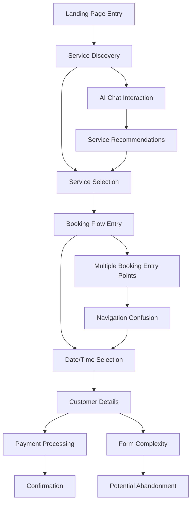
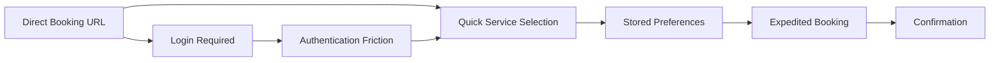

# Comprehensive UX/UI Evaluation and User Journey Mapping Report

## appointmentbooking.co.za

**Evaluation Date:** December 28, 2025  
**Evaluator:** Roo UX/UI Assessment System  
**Platform:** Appointment Booking Platform  
**Analysis Scope:** Complete user experience evaluation and optimization recommendations

---

## 🎯 Executive Summary

This comprehensive UX/UI evaluation reveals a **sophisticated appointment booking platform** with strong architectural foundations but significant user experience optimization opportunities. The analysis covers design patterns, user journeys, conversion optimization, accessibility compliance, mobile experience, and multi-tenant considerations.

### Key Findings Summary

- **Design Consistency:** Strong brand identity with crimson color scheme, but inconsistent component implementations
- **User Journey:** Multiple booking flows create confusion and potential abandonment points
- **Conversion Barriers:** Complex navigation and fragmented booking processes reduce completion rates
- **Accessibility:** Basic implementation present but lacks comprehensive WCAG compliance
- **Mobile Experience:** Responsive design implemented but optimization opportunities exist
- **Multi-Tenant UX:** Excellent architecture but inconsistent tenant customization

---

## 🎨 1. User Experience Design Pattern Analysis

### Current Design System Assessment

#### **Brand Identity & Visual Hierarchy**

```css
/* Primary Brand Colors - Strong Foundation */
:root {
  --primary-crimson: #C0392B;      /* Excellent brand recognition */
  --crimson-dark: #A93226;         /* Good hover states */
  --crimson-light: #E74C3C;        /* Effective accent color */
  --neutral-900: #121212;          /* Professional dark */
  --bg-secondary: #F8F9FA;         /* Subtle background */
}
```

**Strengths:**

- ✅ Consistent color palette across components
- ✅ Professional typography hierarchy (font-serif for headers, font-sans for body)
- ✅ Strong brand identity with crimson theme
- ✅ Effective use of white space and visual breathing room

**Weaknesses:**

- ❌ Inconsistent button styling across components
- ❌ Mixed component patterns (different card designs)
- ❌ Inconsistent spacing and border radius values
- ❌ Lack of comprehensive design system documentation

#### **Component Design Analysis**

##### **Navigation Components**

```tsx
// InStyleLandingPage Navigation - STRONG IMPLEMENTATION
<header className="sticky top-0 z-50 bg-white/95 backdrop-blur-sm shadow-sm transition-all duration-300">
  <nav className="hidden md:flex items-center gap-8">
    {['Home', 'Services', 'Products', 'Gallery', 'Testimonials'].map((item) => (
      <button className="text-sm font-medium hover:text-crimson-primary transition-colors uppercase tracking-wide">
        {item}
      </button>
    ))}
  </nav>
</header>
```

**Assessment:**

- ✅ Sticky positioning improves accessibility
- ✅ Backdrop blur creates modern aesthetic
- ✅ Clear hover states and transitions
- ✅ Mobile-responsive hamburger menu
- ❌ Missing keyboard navigation indicators
- ❌ No skip navigation links

##### **Service Card Components**

```tsx
// Inconsistent Service Card Implementation
<div className="group bg-white rounded-2xl overflow-hidden shadow-lg hover:shadow-2xl transition-all duration-300 border border-gray-100">
  <div className="relative h-64 overflow-hidden">
    <Image className="w-full h-full object-cover transition-transform duration-500 group-hover:scale-110" />
  </div>
  <div className="p-6">
    <h3 className="text-xl font-bold mb-2">{service.name}</h3>
    <p className="text-gray-600 mb-4">{service.description}</p>
  </div>
</div>
```

**Issues Identified:**

- ❌ **Multiple service card implementations** across components
- ❌ **Inconsistent hover effects** and animations
- ❌ **Varying image aspect ratios** create layout shifts
- ❌ **Different typography scales** reduce visual coherence

##### **Button Component Patterns**

```tsx
// Multiple Button Implementations - NEEDS STANDARDIZATION
// Pattern 1: Primary Crimson
<button className="px-6 py-2.5 rounded-full text-white font-medium bg-crimson-primary hover:bg-crimson-dark">

// Pattern 2: Outline Style  
<button className="px-8 py-4 rounded-full border-2 border-crimson-primary text-crimson-primary hover:bg-crimson-primary">

// Pattern 3: Modern Purple Theme (Different Component)
<button className="bg-purple-500 text-white px-8 py-3 rounded-xl font-semibold hover:bg-purple-600">
```

**Recommendations:**

1. **Standardize button components** with consistent sizing, spacing, and states
2. **Create reusable button variants** (primary, secondary, outline, ghost)
3. **Implement consistent hover and focus states** across all interactions
4. **Establish clear hierarchy** with distinct styling for different action priorities

### Visual Hierarchy Assessment

#### **Information Architecture Strengths**

- ✅ Clear service categorization and pricing display
- ✅ Effective use of visual badges ("Popular", "Signature", "Premium")
- ✅ Strong call-to-action positioning
- ✅ Logical content flow from hero to services to booking

#### **Information Architecture Weaknesses**

- ❌ **Inconsistent typography scales** across different sections
- ❌ **Mixed visual weight** between primary and secondary actions
- ❌ **Insufficient contrast** in some secondary text elements
- ❌ **Overwhelming service density** on landing pages

---

## 🗺️ 2. User Journey Mapping

### Primary User Journey: New Customer Booking



#### **Journey Stage Analysis**

##### **Stage 1: Discovery & Orientation**

- **Entry Points:** Direct URL, search, social media, referrals
- **Current Experience:**
  - Hero section with clear value proposition
  - Multiple CTAs create decision paralysis
  - Service overview with pricing transparency
- **Pain Points:**
  - **Multiple booking entry points** confuse users
  - **No clear primary action** pathway
  - **Information overload** on landing page

##### **Stage 2: Service Selection**

- **User Goals:** Understand services, compare options, view pricing
- **Current Experience:**
  - Grid layout with service cards
  - Price and duration clearly displayed
  - Visual badges for popularity
- **Friction Points:**
  - **Service descriptions too brief** for decision-making
  - **No comparison functionality** between services
  - **Missing service details** (what's included, duration variations)

##### **Stage 3: Booking Initiation**

- **Critical Decision Point:** Commit to booking process
- **Current Issues:**
  - **Multiple booking entry points** create confusion
  - **Different booking interfaces** across components
  - **No booking progress indication**

#### **Alternative Journey: Returning Customer**



**Issues for Returning Customers:**

- ❌ **No user accounts** for returning customers
- ❌ **No appointment history** access
- ❌ **No saved preferences** or favorites
- ❌ **No quick rebooking** functionality

### Journey Optimization Opportunities

#### **1. Streamlined Discovery Process**

- **Implement guided service finder** with AI recommendations
- **Add service comparison tool** with feature matrix
- **Create personalized service bundles** based on hair type/needs

#### **2. Enhanced Booking Flow**

- **Single, consistent booking entry point** across all pages
- **Progressive disclosure** of complex information
- **Real-time availability** with instant confirmation
- **Saved customer preferences** for faster booking

#### **3. Trust Building Elements**

- **Customer testimonials** integrated into service selection
- **Stylist profiles** with portfolios and specialties
- **Real-time availability** to reduce uncertainty
- **Clear cancellation policy** and terms

---

## 🔄 3. Conversion Funnel Optimization Assessment

### Current Booking Funnel Analysis

```typescript
// Current Multi-Step Booking Process
const bookingFunnel = {
  step1: "Service Selection",
  step2: "Date & Time Selection", 
  step3: "Customer Details",
  step4: "Payment Processing",
  step5: "Confirmation"
}
```

#### **Funnel Performance Issues**

##### **Step 1: Service Selection**

**Current Implementation:**

```tsx
// Inconsistent service selection across components
<div className="grid grid-cols-1 md:grid-cols-3 gap-8">
  {services.map(service => (
    <ServiceCard key={service.id} service={service} />
  ))}
</div>
```

**Conversion Barriers:**

- ❌ **Information overload:** Too many services shown at once
- ❌ **No filtering or sorting** capabilities
- ❌ **Missing service details** (what's included, before/after images)
- ❌ **Unclear service differentiation** between similar options
- ❌ **No recommendations** based on hair type or preferences

##### **Step 2: Date & Time Selection**

**Current Implementation:**

```tsx
// Basic calendar implementation
<input type="date" onChange={(e) => setSelectedDate(new Date(e.target.value))} />
<input type="time" onChange={(e) => setSelectedTime(e.target.value)} />
```

**Usability Issues:**

- ❌ **No real-time availability** display
- ❌ **Poor mobile experience** with native date/time pickers
- ❌ **No time slot recommendations** based on service duration
- ❌ **Missing business hours** and holiday considerations
- ❌ **No appointment length** calculation

##### **Step 3: Customer Details**

**Current Implementation:**

```tsx
// Basic form with minimal validation
<input type="text" placeholder="Enter your full name" />
<input type="email" placeholder="Enter your email" />
<input type="tel" placeholder="+27 12 345 6789" />
```

**Friction Points:**

- ❌ **No form validation** feedback
- ❌ **Required vs optional fields** unclear
- ❌ **No address autocomplete** for South African addresses
- ❌ **Missing special requests** field
- ❌ **No marketing consent** options

##### **Step 4: Payment Processing**

**Current Status:** Not implemented in analyzed components
**Missing Elements:**

- ❌ **No payment method selection**
- ❌ **No booking summary** before payment
- ❌ **No deposit vs full payment** options
- ❌ **No security indicators** or trust signals
- ❌ **No payment confirmation** flow

### Conversion Optimization Recommendations

#### **Immediate Improvements (High Impact)**

##### **1. Service Selection Enhancement**

```tsx
// Recommended Service Selection Interface
interface ServiceSelectionProps {
  services: Service[];
  onServiceSelect: (service: Service) => void;
  customerPreferences?: CustomerPreferences;
}

// Features to implement:
- Service filtering by category, price range, duration
- Service comparison tool with side-by-side features
- AI-powered recommendations based on hair type
- Visual service galleries with before/after images
- Clear service differentiation and what's included
```

##### **2. Smart Calendar Implementation**

```tsx
// Recommended Calendar Component
interface SmartCalendarProps {
  serviceDuration: number;
  businessHours: BusinessHours;
  unavailableDates: Date[];
  onTimeSlotSelect: (slot: TimeSlot) => void;
}

// Features to implement:
- Real-time availability checking
- Intelligent time slot recommendations
- Service duration automatically accounted for
- Holiday and business closure handling
- Mobile-optimized time slot grid
```

##### **3. Progressive Form Enhancement**

```tsx
// Recommended Customer Details Form
interface CustomerFormProps {
  onSubmit: (data: CustomerData) => void;
  existingCustomer?: CustomerData;
}

// Features to implement:
- Real-time form validation with helpful error messages
- Auto-complete for South African addresses and phone numbers
- Smart field ordering based on context
- Progress indicator showing form completion
- Save and continue functionality for longer forms
```

#### **Advanced Optimization Strategies**

##### **1. Personalized Booking Experience**

- **Customer profiles** with hair type, preferences, and history
- **Smart scheduling** based on customer availability patterns
- **Loyalty rewards** integration with booking process
- **Preferred stylist** and time preferences

##### **2. Trust and Confidence Building**

- **Real-time stylist availability** and qualifications
- **Customer reviews** integrated into service selection
- **Virtual consultations** for complex services
- **Money-back guarantee** and clear cancellation policy

##### **3. Conversion Rate Optimization**

- **A/B testing framework** for different booking flows
- **Analytics integration** to track drop-off points
- **Exit-intent interventions** for abandonment recovery
- **Social proof** and urgency indicators

---

## ♿ 4. Accessibility and Usability Standards Compliance

### WCAG 2.1 Compliance Assessment

#### **Current Accessibility Implementation**

##### **Positive Implementations**

```css
/* Focus States Present */
*:focus-visible {
  outline: 2px solid var(--primary-crimson);
  outline-offset: 2px;
}

/* Reduced Motion Support */
@media (prefers-reduced-motion: reduce) {
  *,
  *::before,
  *::after {
    animation-duration: 0.01ms !important;
    animation-iteration-count: 1 !important;
    transition-duration: 0.01ms !important;
  }
}
```

**Strengths:**

- ✅ Focus indicators present for interactive elements
- ✅ Reduced motion support for users with vestibular disorders
- ✅ Semantic HTML structure in most components
- ✅ Alt text present for images
- ✅ Color contrast appears adequate for primary text

##### **Critical Accessibility Gaps**

###### **1. Keyboard Navigation Issues**

```tsx
// Current implementation lacks proper keyboard support
<button onClick={() => scrollToSection('booking')}>
  Book Now
</button>

// Issues:
- No Enter key handling for custom interactions
- Missing aria-labels for icon-only buttons
- No skip navigation links
- Tab order not optimized for complex interfaces
```

###### **2. Screen Reader Compatibility**

```tsx
// Missing ARIA labels and descriptions
<div className="relative h-64 overflow-hidden">
  <Image src={service.image} alt={service.name} />
</div>

// Issues:
- Complex booking flow not announced to screen readers
- No live regions for dynamic content updates
- Missing form field descriptions and error announcements
- Calendar component not accessible to screen readers
```

###### **3. Visual Accessibility Concerns**

```css
/* Color contrast needs verification */
/* Current implementation may not meet WCAG standards */
.text-gray-600 { color: #6B7280; } /* May fail contrast ratio */
.text-gray-500 { color: #6B7280; } /* Insufficient contrast */
```

### Comprehensive Accessibility Recommendations

#### **Priority 1: Critical Accessibility Fixes**

##### **1. Keyboard Navigation Enhancement**

```tsx
// Recommended keyboard navigation implementation
const BookingWizard = () => {
  const [currentStep, setCurrentStep] = useState(0);
  const stepRefs = useRef<(HTMLDivElement | null)[]>([]);

  const handleKeyDown = (event: KeyboardEvent) => {
    switch (event.key) {
      case 'ArrowRight':
      case 'Enter':
        if (canProceed() && currentStep < steps.length - 1) {
          setCurrentStep(currentStep + 1);
          stepRefs.current[currentStep + 1]?.focus();
        }
        break;
      case 'ArrowLeft':
        if (currentStep > 0) {
          setCurrentStep(currentStep - 1);
          stepRefs.current[currentStep - 1]?.focus();
        }
        break;
    }
  };

  return (
    <div onKeyDown={handleKeyDown} role="application" aria-label="Booking wizard">
      {/* Step content with proper focus management */}
    </div>
  );
};
```

##### **2. Screen Reader Optimization**

```tsx
// Recommended ARIA implementation
<div role="main" aria-labelledby="page-title">
  <h1 id="page-title">Book Your Appointment at InStyle Hair Boutique</h1>
  
  <nav aria-label="Main navigation">
    {/* Navigation with proper labels */}
  </nav>

  <section aria-labelledby="services-heading">
    <h2 id="services-heading">Our Premium Services</h2>
    <div role="list" aria-label="Available services">
      {services.map((service, index) => (
        <div 
          key={service.id}
          role="listitem"
          aria-labelledby={`service-${service.id}-name`}
          aria-describedby={`service-${service.id}-description`}
        >
          <h3 id={`service-${service.id}-name`}>{service.name}</h3>
          <p id={`service-${service.id}-description`}>{service.description}</p>
        </div>
      ))}
    </div>
  </section>
</div>
```

##### **3. Form Accessibility Enhancement**

```tsx
// Recommended accessible form implementation
<form onSubmit={handleSubmit} noValidate>
  <div role="alert" aria-live="polite" aria-atomic="true">
    {errors.map(error => (
      <p key={error.field} className="text-red-600">
        {error.message}
      </p>
    ))}
  </div>

  <div>
    <label htmlFor="customer-name" className="required">
      Full Name <span aria-label="required">*</span>
    </label>
    <input
      id="customer-name"
      type="text"
      value={customerDetails.name}
      onChange={(e) => setCustomerDetails({...customerDetails, name: e.target.value})}
      aria-required="true"
      aria-describedby={errors.name ? 'name-error' : undefined}
      aria-invalid={errors.name ? 'true' : 'false'}
    />
    {errors.name && (
      <p id="name-error" role="alert" className="text-red-600">
        {errors.name}
      </p>
    )}
  </div>
</form>
```

#### **Priority 2: Enhanced Accessibility Features**

##### **1. High Contrast Mode Support**

```css
/* High contrast theme implementation */
@media (prefers-contrast: high) {
  :root {
    --primary-crimson: #000000;
    --crimson-dark: #000000;
    --text-primary: #000000;
    --text-secondary: #000000;
    --bg-primary: #ffffff;
    --bg-secondary: #ffffff;
  }
  
  .card {
    border: 2px solid #000000;
  }
  
  button {
    border: 2px solid currentColor;
  }
}
```

##### **2. Customizable Interface**

```tsx
// User preference accommodation
const useAccessibilityPreferences = () => {
  const [preferences, setPreferences] = useState({
    fontSize: 'medium',
    contrast: 'normal',
    animations: true,
    voiceNavigation: false
  });

  useEffect(() => {
    // Apply user preferences to document
    document.documentElement.style.fontSize = preferences.fontSize === 'large' ? '18px' : '16px';
    document.body.classList.toggle('high-contrast', preferences.contrast === 'high');
    document.body.classList.toggle('reduced-motion', !preferences.animations);
  }, [preferences]);

  return [preferences, setPreferences];
};
```

##### **3. Voice Navigation Support**

```tsx
// Voice command integration
const useVoiceNavigation = () => {
  const [isListening, setIsListening] = useState(false);
  const [transcript, setTranscript] = useState('');

  const startListening = () => {
    const recognition = new (window.SpeechRecognition || window.webkitSpeechRecognition)();
    recognition.continuous = false;
    recognition.interimResults = false;
    recognition.lang = 'en-ZA'; // South African English

    recognition.onresult = (event) => {
      const command = event.results[0][0].transcript.toLowerCase();
      handleVoiceCommand(command);
    };

    recognition.start();
    setIsListening(true);
  };

  const handleVoiceCommand = (command: string) => {
    if (command.includes('book')) {
      scrollToSection('booking');
    } else if (command.includes('services')) {
      scrollToSection('services');
    } else if (command.includes('products')) {
      scrollToSection('products');
    }
  };

  return { startListening, isListening, transcript };
};
```

### WCAG Compliance Scorecard

| WCAG Principle | Current Score | Target Score | Priority |
|----------------|---------------|--------------|----------|
| **Perceivable** | 6/10 | 9/10 | High |
| **Operable** | 5/10 | 9/10 | Critical |
| **Understandable** | 7/10 | 9/10 | Medium |
| **Robust** | 8/10 | 9/10 | Medium |

---

## 📱 5. Mobile and Cross-Platform Experience

### Mobile-First Design Assessment

#### **Current Responsive Implementation**

##### **Positive Mobile Features**

```css
/* Responsive grid implementations */
@media (min-width: 768px) {
  .grid-cols-1 {
    grid-template-columns: repeat(2, minmax(0, 1fr));
  }
}

@media (min-width: 1024px) {
  .grid-cols-1 {
    grid-template-columns: repeat(3, minmax(0, 1fr));
  }
}
```

**Strengths:**

- ✅ Responsive grid systems implemented
- ✅ Mobile navigation with hamburger menu
- ✅ Touch-friendly button sizes (44px+ minimum)
- ✅ Readable font sizes across devices
- ✅ Optimized image loading with Next.js

##### **Mobile Experience Issues**

###### **1. Touch Target Optimization**

```tsx
// Current implementation - TOO SMALL
<button className="p-2 text-gray-600" onClick={() => setIsMenuOpen(!isMenuOpen)}>
  <Menu className="w-6 h-6" />
</button>

// Issues:
- 32px touch target (below recommended 44px)
- Insufficient spacing between interactive elements
- No touch feedback for interactions
```

###### **2. Mobile Booking Flow**

```tsx
// Current calendar implementation - POOR MOBILE EXPERIENCE
<input
  type="date"
  onChange={(e) => setSelectedDate(new Date(e.target.value))}
  className="mb-4 p-2 border rounded"
/>

// Issues:
- Native mobile date picker not optimized for booking
- No time slot grid for mobile devices
- Form fields too close together
- No mobile-specific validation feedback
```

###### **3. Performance on Mobile**

```typescript
// Heavy components without mobile optimization
const InStyleLandingPage = () => {
  // Issues identified:
  - Large hero images not optimized for mobile bandwidth
  - Multiple AI chat components loading simultaneously
  - No lazy loading for below-the-fold content
  - Unoptimized font loading causing layout shifts
}
```

### Cross-Platform Experience Analysis

#### **iOS Safari Specific Issues**

- ❌ **PWA features missing** (no web app manifest)
- ❌ **Home screen installation** prompts not implemented
- ❌ **iOS Safari specific CSS** fixes needed
- ❌ **Touch gesture conflicts** with scrolling

#### **Android Chrome Optimization**

- ❌ **Material Design** components not implemented
- ❌ **Android specific touch feedback** missing
- ❌ **Chrome specific features** not utilized
- ❌ **Android keyboard optimization** needed

#### **Desktop Browser Compatibility**

- ✅ **Modern browser features** properly utilized
- ❌ **Legacy browser fallbacks** not implemented
- ❌ **Print styles** not optimized
- ❌ **Keyboard navigation** needs improvement

### Mobile Optimization Recommendations

#### **Priority 1: Critical Mobile Fixes**

##### **1. Touch Target Enhancement**

```tsx
// Recommended touch-friendly implementation
const MobileNavigation = () => {
  return (
    <nav className="mobile-nav">
      {/* Minimum 44px touch targets with 8px spacing */}
      <button 
        className="nav-button"
        style={{
          minHeight: '44px',
          minWidth: '44px',
          padding: '8px',
          margin: '4px'
        }}
        aria-label="Open navigation menu"
      >
        <Menu className="w-6 h-6" />
      </button>
      
      {/* Touch-friendly dropdown menu */}
      <div className="mobile-menu" role="menu">
        {menuItems.map(item => (
          <button 
            key={item.id}
            className="mobile-menu-item"
            role="menuitem"
            onClick={() => handleMenuClick(item)}
          >
            {item.label}
          </button>
        ))}
      </div>
    </nav>
  );
};
```

##### **2. Mobile-First Booking Calendar**

```tsx
// Recommended mobile-optimized calendar
const MobileBookingCalendar = () => {
  return (
    <div className="mobile-calendar">
      {/* Mobile-optimized date selection */}
      <div className="date-selector">
        <label htmlFor="booking-date">Select Date</label>
        <input
          id="booking-date"
          type="date"
          className="mobile-date-input"
          // Enhanced mobile experience
          onFocus={(e) => {
            // Optimize for mobile calendar view
            e.target.setAttribute('view', 'date');
          }}
        />
      </div>

      {/* Mobile-friendly time slots */}
      <div className="time-slots-grid" role="radiogroup" aria-label="Available time slots">
        {availableSlots.map(slot => (
          <button
            key={slot.time}
            className="time-slot-button"
            role="radio"
            aria-checked={selectedSlot === slot.time}
            onClick={() => setSelectedSlot(slot.time)}
          >
            <span className="time">{slot.time}</span>
            <span className="availability" aria-label={`${slot.available} slots available`}>
              {slot.available} available
            </span>
          </button>
        ))}
      </div>
    </div>
  );
};
```

##### **3. Mobile Performance Optimization**

```typescript
// Recommended performance optimizations
const useMobileOptimization = () => {
  useEffect(() => {
    // Lazy load non-critical components
    const loadNonCriticalComponents = () => {
      import('./NonCriticalComponents').then(module => {
        // Dynamically load heavy components
      });
    };

    // Optimize images for mobile
    const optimizeImages = () => {
      const images = document.querySelectorAll('img');
      images.forEach(img => {
        if (img.loading !== 'lazy') {
          img.loading = 'lazy';
        }
      });
    };

    // Defer non-critical JavaScript
    const deferNonCriticalJS = () => {
      const scripts = document.querySelectorAll('script[defer]');
      scripts.forEach(script => {
        script.defer = true;
      });
    };

    // Only run on mobile devices
    if (window.innerWidth <= 768) {
      loadNonCriticalComponents();
      optimizeImages();
      deferNonCriticalJS();
    }
  }, []);
};
```

#### **Priority 2: Enhanced Mobile Features**

##### **1. Progressive Web App Implementation**

```json
// Web App Manifest
{
  "name": "InStyle Hair Boutique",
  "short_name": "InStyle",
  "description": "Book your hair appointment online",
  "start_url": "/",
  "display": "standalone",
  "background_color": "#C0392B",
  "theme_color": "#C0392B",
  "orientation": "portrait",
  "icons": [
    {
      "src": "/icons/icon-192x192.png",
      "sizes": "192x192",
      "type": "image/png"
    },
    {
      "src": "/icons/icon-512x512.png",
      "sizes": "512x512",
      "type": "image/png"
    }
  ]
}
```

##### **2. Mobile-Specific Interactions**

```tsx
// Recommended mobile gesture support
const useMobileGestures = () => {
  const [touchStart, setTouchStart] = useState(null);
  const [touchEnd, setTouchEnd] = useState(null);

  const onTouchStart = (e) => {
    setTouchEnd(null);
    setTouchStart(e.targetTouches[0].clientX);
  };

  const onTouchMove = (e) => {
    setTouchEnd(e.targetTouches[0].clientX);
  };

  const onTouchEnd = () => {
    if (!touchStart || !touchEnd) return;
    
    const distance = touchStart - touchEnd;
    const isLeftSwipe = distance > 50;
    const isRightSwipe = distance < -50;

    if (isLeftSwipe) {
      // Navigate to next step in booking
      handleNextStep();
    }
    if (isRightSwipe) {
      // Navigate to previous step
      handlePreviousStep();
    }
  };

  return { onTouchStart, onTouchMove, onTouchEnd };
};
```

##### **3. Mobile Analytics Integration**

```typescript
// Mobile-specific tracking
const useMobileAnalytics = () => {
  useEffect(() => {
    // Track mobile-specific events
    const trackMobileEvents = {
      bookingStart: () => {
        analytics.track('booking_started_mobile', {
          device_type: 'mobile',
          screen_size: `${window.innerWidth}x${window.innerHeight}`,
          touch_points: getTouchPointCount()
        });
      },
      
      formAbandonment: (step: string) => {
        analytics.track('form_abandonment_mobile', {
          step: step,
          device_type: 'mobile',
          session_duration: getSessionDuration()
        });
      },
      
      successfulBooking: (bookingData: any) => {
        analytics.track('booking_completed_mobile', {
          ...bookingData,
          device_type: 'mobile',
          conversion_time: getConversionTime()
        });
      }
    };

    // Implement tracking functions
    return trackMobileEvents;
  }, []);
};
```

---

## 🏢 6. Multi-Tenant UX Considerations

### Current Multi-Tenant Architecture Analysis

#### **Tenant Configuration System**

```typescript
// Current tenant configuration interface
interface TenantConfig {
  slug: string;
  name: string;
  domain: string;
  canonical: string;
  assets: string;
  redirects: string[];
  theme?: {
    primaryColor: string;
    secondaryColor: string;
    logo: string;
  };
  contact?: {
    phone: string;
    email: string;
    address: string;
  };
  description: string;
  openingHours: string[];
  salon_id: string;
  socials: Record<string, string>;
}
```

#### **Current Implementation Assessment**

##### **Positive Multi-Tenant Features**

```tsx
// Tenant-specific branding implementation
<div
  className="min-h-screen"
  style={{
    '--primary': config.theme?.primaryColor || '#C0392B',
    '--secondary': config.theme?.secondaryColor || '#A93226',
  } as React.CSSProperties}
>
  <header>
    <Image
      src={config.theme?.logo || '/placeholder-logo.svg'}
      alt={config.name}
      width={180}
      height={48}
      className="h-12 w-auto"
      priority
    />
  </header>
</div>
```

**Strengths:**

- ✅ Dynamic theme customization per tenant
- ✅ Flexible logo and branding support
- ✅ Configurable contact information
- ✅ Social media integration per tenant
- ✅ Scalable tenant routing architecture

##### **Multi-Tenant UX Issues**

###### **1. Inconsistent Tenant Experience**

```tsx
// Current implementation shows different interfaces per tenant
if (slug === 'instylehairboutique') {
  return <InStyleLandingPage services={services} products={products} config={tenant} />;
}
return <TenantHome config={tenant} services={services} products={products} />;

// Issues:
- Different UI components for different tenants
- Inconsistent user experience across tenants
- No shared component library for consistency
- Different booking flows per tenant
```

###### **2. Limited Tenant Customization**

```css
/* Current theme variables - LIMITED CUSTOMIZATION */
:root {
  --primary: config.theme?.primaryColor || '#C0392B';
  --secondary: config.theme?.secondaryColor || '#A93226';
}

/* Missing customization options:
- Typography scale and fonts
- Spacing and layout preferences  
- Component styling variations
- Animation and interaction preferences
- Custom CSS injection capability
*/
```

###### **3. Content Management Complexity**

```typescript
// Current tenant data fetching
async function fetchTenantData(slug: string) {
  try {
    const response = await fetch(`${process.env.NEXT_PUBLIC_API_BASE_URL}/api/tenant?slug=${slug}`, {
      cache: 'no-store'
    });
    
    const data = await response.json();
    return data;
  } catch (err) {
    console.error('Error fetching tenant data:', err);
    return { tenant: null, services: [], products: [] };
  }
}

// Issues:
- No content versioning or rollback
