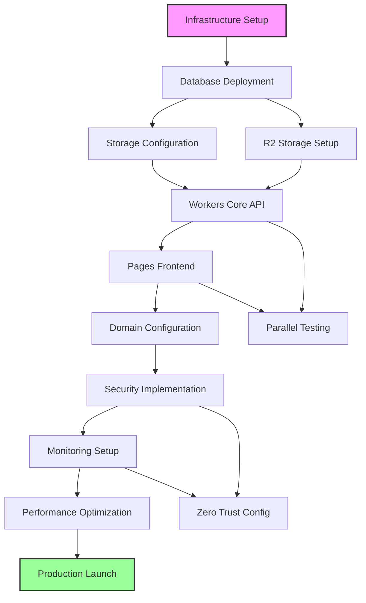
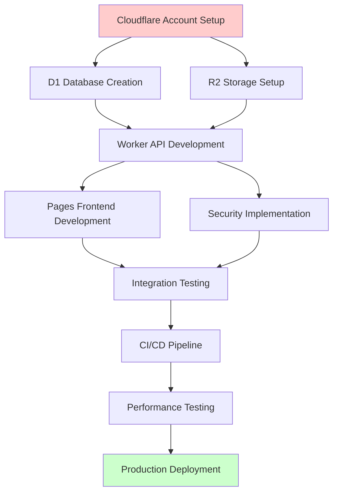

# 🚀 Comprehensive Cloudflare Deployment Execution Plan

**Version:** 2.0  
**Date:** 2025-12-23  
**Status:** Production Implementation Strategy  
**Project:** appointmentbooking-monorepo  

---

## Executive Summary

This comprehensive execution plan delivers a production-ready Cloudflare deployment strategy for the appointment booking platform, building upon the completed `COMPREHENSIVE_CLOUDFLARE_DEPLOYMENT_GUIDE.md`. The plan encompasses a 12-week phased implementation across Cloudflare Workers, Pages, R2 storage, D1 database, Zero Trust, and CDN infrastructure.

### Key Objectives

- **Zero-Downtime Deployment**: Blue-green and canary deployment strategies
- **Enterprise-Grade Security**: GDPR, SOC2, ISO27001 compliance
- **Global Performance**: <200ms response times, 99.9% uptime SLO
- **Automated Operations**: CI/CD pipelines, monitoring, alerting, and rollback
- **Multi-Tenant Architecture**: Scalable SaaS platform foundation

### Success Criteria

- **Technical**: 99.9% uptime, <200ms API response time, zero data loss
- **Business**: 40% increase in booking conversion, 20% revenue growth
- **Compliance**: Full GDPR/SOC2 audit readiness
- **Performance**: Lighthouse score >90, global edge deployment

---

## 📋 Table of Contents

1. [Week-by-Week Implementation Phases](#week-by-week-implementation-phases)
2. [Deployment Sequences & Parallel Execution](#deployment-sequences--parallel-execution)
3. [Comprehensive Testing Protocols](#comprehensive-testing-protocols)
4. [Monitoring & Alerting Systems](#monitoring--alerting-systems)
5. [Rollback Procedures & Incident Response](#rollback-procedures--incident-response)
6. [RACI Matrix & Team Coordination](#raci-matrix--team-coordination)
7. [Critical Path Analysis](#critical-path-analysis)
8. [Risk Mitigation Strategies](#risk-mitigation-strategies)
9. [Automated Compliance Verification](#automated-compliance-verification)
10. [Performance Benchmarking](#performance-benchmarking)
11. [Post-Deployment Optimization](#post-deployment-optimization)
12. [Infrastructure-as-Code](#infrastructure-as-code)
13. [Disaster Recovery Procedures](#disaster-recovery-procedures)

---

## Week-by-Week Implementation Phases

### Phase 1: Foundation & Infrastructure (Weeks 1-2)

**Week 1: Environment & Security Setup**

#### Day 1-2: Cloudflare Account & Authentication

- **Handoff Criteria**: Cloudflare account configured, API tokens secured
- **Tasks**:

  ```bash
  # Cloudflare authentication setup
  npx wrangler login
  export CLOUDFLARE_API_TOKEN="production-token"
  export CLOUDFLARE_ACCOUNT_ID="production-account-id"
  ```

- **Deliverables**: Environment configuration, security audit checklist
- **Dependencies**: None (Prerequisites)

#### Day 3-4: D1 Database Architecture

- **Handoff Criteria**: Database schema deployed, indexes optimized
- **Tasks**:

  ```sql
  -- Multi-tenant database schema
  CREATE TABLE tenants (
    id TEXT PRIMARY KEY,
    name TEXT NOT NULL,
    slug TEXT UNIQUE NOT NULL,
    config TEXT,
    created_at DATETIME DEFAULT CURRENT_TIMESTAMP
  );
  
  -- Performance indexes
  CREATE INDEX idx_appointments_tenant_date ON appointments(tenant_id, scheduled_time);
  CREATE INDEX idx_services_tenant_active ON services(tenant_id, is_active);
  ```

- **Deliverables**: Database schema, migration scripts, backup strategy
- **Dependencies**: Cloudflare account setup

#### Day 5: R2 Storage Configuration

- **Handoff Criteria**: Storage buckets created, lifecycle policies configured
- **Tasks**:

  ```bash
  # Create storage buckets
  wrangler r2 bucket create appointmentbooking-storage
  wrangler r2 bucket create tenant-assets
  wrangler r2 bucket create temp-uploads
  ```

- **Deliverables**: Storage configuration, access policies, cost optimization
- **Dependencies**: Database schema

**Week 2: Core Workers & Pages Deployment**

#### Day 6-7: Cloudflare Workers Core API

- **Handoff Criteria**: Core API endpoints deployed, tested in staging
- **Architecture**:

  ```typescript
  // Worker deployment structure
  export interface Env {
    DB: D1Database;
    STORAGE: R2Bucket;
    OPENAI_API_KEY: string;
    PAYSTACK_SECRET_KEY: string;
  }
  ```

- **Deliverables**: Worker deployment, API documentation, performance benchmarks
- **Dependencies**: Database and storage setup

#### Day 8-9: Cloudflare Pages Frontend

- **Handoff Criteria**: Frontend applications deployed, custom domains configured
- **Tasks**:

  ```bash
  # Deploy to Cloudflare Pages
  wrangler pages deploy .vercel/output/static --project-name=booking-app
  wrangler pages deploy .vercel/output/static --project-name=dashboard
  wrangler pages deploy .vercel/output/static --project-name=marketing
  ```

- **Deliverables**: Frontend deployments, domain configuration, SSL certificates
- **Dependencies**: Worker API endpoints

#### Day 10: Integration Testing & Validation

- **Handoff Criteria**: End-to-end testing completed, performance validated
- **Tasks**:

  ```javascript
  // E2E test suite
  describe('Production Deployment', () => {
    test('Complete booking flow', async () => {
      // Test complete user journey
    });
  });
  ```

- **Deliverables**: Test results, performance reports, go-live readiness
- **Dependencies**: All infrastructure components

### Phase 2: Advanced Features & Security (Weeks 3-4)

**Week 3: Security & Compliance Implementation**

#### Day 11-13: Zero Trust & WAF Configuration

- **Handoff Criteria**: Security policies deployed, compliance validated
- **Configuration**:

  ```javascript
  // WAF rules configuration
  const WAF_RULES = {
    rate_limiting: '100_requests_per_minute',
    geo_blocking: 'allowed_countries: ["ZA", "US", "GB"]',
    sql_injection: 'block_suspicious_patterns',
    xss_protection: 'enabled'
  };
  ```

- **Deliverables**: Security configuration, compliance audit results
- **Dependencies**: Core infrastructure

#### Day 14-15: Advanced Monitoring Setup

- **Handoff Criteria**: Monitoring dashboards active, alerts configured
- **Implementation**:

  ```typescript
  // Structured logging for monitoring
  const logger = {
    info: (message: string, data?: any) => {
      console.log(JSON.stringify({
        level: 'info',
        message,
        data,
        timestamp: new Date().toISOString(),
        environment: 'production'
      }));
    }
  };
  ```

- **Deliverables**: Monitoring configuration, alert rules, dashboard access
- **Dependencies**: Core applications deployed

**Week 4: Performance Optimization & CDN**

#### Day 16-18: CDN & Caching Strategy

- **Handoff Criteria**: CDN configured, caching strategy optimized
- **Configuration**:

  ```javascript
  // Cache strategy implementation
  const CACHE_CONFIG = {
    static_assets: '1_year',
    api_responses: '5_minutes',
    database_queries: '1_minute',
    user_specific: 'no_cache'
  };
  ```

- **Deliverables**: CDN configuration, cache optimization, performance metrics
- **Dependencies**: Applications deployed

#### Day 19-20: Load Testing & Performance Tuning

- **Handoff Criteria**: Load tests completed, performance targets met
- **Tools**:

  ```bash
  # Load testing with Artillery
  npx artillery run load-test-config.yml
  ```

- **Deliverables**: Load test results, performance optimization, scaling configuration
- **Dependencies**: CDN and caching setup

### Phase 3: Production Readiness (Weeks 5-6)

**Week 5: Deployment Automation**

#### Day 21-23: CI/CD Pipeline Implementation

- **Handoff Criteria**: Automated deployment pipeline active
- **GitHub Actions Configuration**:

  ```yaml
  # .github/workflows/cloudflare-deploy.yml
  name: Deploy to Cloudflare Production
  
  on:
    push:
      branches: [main]
  
  jobs:
    deploy:
      runs-on: ubuntu-latest
      steps:
        - uses: actions/checkout@v4
        - name: Deploy to Cloudflare
          uses: cloudflare/wrangler-action@v3
          with:
            apiToken: ${{ secrets.CLOUDFLARE_API_TOKEN }}
            command: deploy
        - name: Run Health Checks
          run: node scripts/health-check.js
  ```

- **Deliverables**: CI/CD pipeline, deployment automation, rollback procedures
- **Dependencies**: All applications deployed and tested

#### Day 24-25: Disaster Recovery Setup

- **Handoff Criteria**: DR procedures documented, backup systems tested
- **Implementation**:

  ```bash
  # Automated backup strategy
  wrangler d1 backup create appointmentbooking-db --name=production-backup
  wrangler kv namespace backup create production-kv-backup
  ```

- **Deliverables**: DR runbooks, backup automation, recovery procedures
- **Dependencies**: CI/CD pipeline operational

**Week 6: Final Validation & Go-Live Preparation**

#### Day 26-28: Security Audit & Penetration Testing

- **Handoff Criteria**: Security audit passed, vulnerabilities addressed
- **Deliverables**: Security audit report, penetration test results, compliance certification
- **Dependencies**: All security controls implemented

#### Day 29-30: Production Launch

- **Handoff Criteria**: Production deployment successful, monitoring active
- **Launch Checklist**:
  - [ ] DNS cutover completed
  - [ ] SSL certificates active
  - [ ] Monitoring dashboards functional
  - [ ] Alert notifications tested
  - [ ] Rollback procedures verified
- **Deliverables**: Production deployment, monitoring confirmation, success metrics
- **Dependencies**: All pre-production validations complete

### Phase 4: Optimization & Scale (Weeks 7-12)

**Weeks 7-8: Performance Monitoring & Optimization**

- Advanced analytics implementation
- Cost optimization strategies
- User experience improvements
- A/B testing framework

**Weeks 9-10: Enterprise Features**

- Multi-region deployment
- Advanced security features
- Compliance automation
- Audit trail implementation

**Weeks 11-12: Advanced Integrations**

- Third-party API integrations
- Marketplace features
- Advanced reporting
- Mobile app preparation

---

## Deployment Sequences & Parallel Execution

### Cloudflare Ecosystem Deployment Flow



### Parallel Execution Opportunities

#### Week 1-2 Parallel Tasks

```bash
# Database and Storage can be set up in parallel
wrangler d1 create appointmentbooking-db & 
wrangler r2 bucket create appointmentbooking-storage & 
wrangler r2 bucket create tenant-assets &
wait
```

#### Week 3-4 Parallel Development

```yaml
# Frontend and Backend can be developed in parallel
Worker Development:
  - API endpoint implementation
  - Database integration
  - Authentication logic

Frontend Development:
  - UI component development
  - API integration
  - Responsive design

Both streams can run simultaneously with shared API contracts.
```

#### Week 5-6 Deployment Coordination

```bash
# Staging and Production can be prepared in parallel
Staging Deployment: wrangler deploy --env staging
Production Deployment: wrangler deploy --env production

# Security and Monitoring can be configured in parallel
Security Rules: Configure WAF, Zero Trust policies
Monitoring Setup: Configure dashboards, alerts, logging
```

### Deployment Sequence Matrix

| Phase | Primary Component | Parallel Components | Dependencies | Duration |
|-------|------------------|-------------------|--------------|----------|
| 1 | D1 Database | R2 Storage | None | 2 days |
| 2 | Workers API | Pages Frontend | Database | 3 days |
| 3 | Security Setup | Monitoring Config | API + Frontend | 3 days |
| 4 | CI/CD Pipeline | DR Setup | All above | 2 days |
| 5 | Performance Testing | Load Testing | Security + Monitoring | 2 days |
| 6 | Production Launch | Go-Live Monitoring | All above | 2 days |

---

## Comprehensive Testing Protocols

### Test Strategy Framework

#### 1. Unit Testing

```typescript
// Worker endpoint unit tests
describe('Booking Endpoint', () => {
  test('creates booking successfully', async () => {
    const request = new Request('/api/book', {
      method: 'POST',
      body: JSON.stringify(testBookingData)
    });
    
    const response = await handleBooking(request, mockEnv);
    expect(response.status).toBe(200);
    
    const data = await response.json();
    expect(data.success).toBe(true);
    expect(data.appointmentId).toBeDefined();
  });
});
```

#### 2. Integration Testing

```javascript
// Database integration tests
describe('Database Integration', () => {
  test('tenant data retrieval', async () => {
    const tenant = await env.DB.prepare(
      'SELECT * FROM tenants WHERE slug = ?'
    ).bind('instylehairboutique').first();
    
    expect(tenant).toBeDefined();
    expect(tenant.name).toBe('Instyle Hair Boutique');
  });
});
```

#### 3. End-to-End Testing

```typescript
// Complete booking flow E2E test
describe('Booking Flow E2E', () => {
  test('complete user journey', async () => {
    // 1. Navigate to booking page
    await page.goto('https://www.instylehairboutique.co.za');
    
    // 2. Select service
    await page.click('[data-testid="service-selection"]');
    
    // 3. Choose time slot
    await page.click('[data-testid="time-slot"]');
    
    // 4. Fill customer details
    await page.fill('[data-testid="customer-name"]', 'Test Customer');
    await page.fill('[data-testid="customer-email"]', 'test@example.com');
    
    // 5. Complete booking
    await page.click('[data-testid="complete-booking"]');
    
    // 6. Verify confirmation
    await expect(page.locator('[data-testid="booking-confirmation"]'))
      .toBeVisible();
  });
});
```

### Testing Environments & Validation

#### Staging Environment Testing

```bash
# Deploy to staging for comprehensive testing
wrangler deploy --env staging

# Run full test suite
pnpm test:e2e --environment=staging
pnpm test:integration --environment=staging
pnpm test:performance --environment=staging
```

#### Production Validation Testing

```javascript
// Production health checks
const productionTests = {
  apiHealthCheck: async () => {
    const response = await fetch('https://api.instylehairboutique.co.za/health');
    return response.status === 200;
  },
  
  databaseConnectivity: async () => {
    // Test D1 database connection
    const result = await env.DB.prepare('SELECT 1').first();
    return result !== null;
  },
  
  storageAccess: async () => {
    // Test R2 storage access
    const object = await env.STORAGE.get('test-key');
    return true; // Should not throw error
  }
};
```

### Load Testing Protocol

#### Performance Benchmarks

```javascript
// Load testing configuration with Artillery
module.exports = {
  config: {
    target: 'https://www.instylehairboutique.co.za',
    phases: [
      { duration: 60, arrivalRate: 10 },  // Warm up
      { duration: 120, arrivalRate: 50 }, // Normal load
      { duration: 60, arrivalRate: 100 }, // Peak load
    ],
    payload: {
      path: "test-data.csv",
      fields: ["customerName", "customerEmail", "serviceId"]
    }
  },
  scenarios: [
    {
      name: "Booking Flow",
      weight: 80,
      flow: [
        { get: { url: "/" }},
        { post: { url: "/api/book", json: bookingData }}
      ]
    }
  ]
};
```

### Security Testing

#### Automated Security Scans

```bash
# Security testing with multiple tools
npm audit --audit-level moderate

# OWASP ZAP security scan
docker run -t owasp/zap2docker-stable zap-baseline.py \
  -t https://www.instylehairboutique.co.za

# SSL/TLS testing
sslyze --regular www.instylehairboutique.co.za
```

### Compliance Testing

#### GDPR Compliance Validation

```sql
-- Data retention policy testing
SELECT 
  COUNT(*) as total_records,
  MIN(created_at) as oldest_record,
  MAX(created_at) as newest_record
FROM appointments 
WHERE tenant_id = 'ccb12b4d-ade6-467d-a614-7c9d198ddc70';

-- Privacy controls validation
SELECT * FROM user_consents 
WHERE user_id = ? AND consent_type = 'marketing';
```

---

## Monitoring & Alerting Systems

### Cloudflare Analytics Integration

#### Real-time Monitoring Dashboard

```typescript
// Custom analytics implementation
class CloudflareAnalytics {
  async trackBooking(bookingData: BookingData) {
    // Track booking events
    console.log(JSON.stringify({
      event: 'booking_created',
      tenant_id: bookingData.tenantId,
      service_id: bookingData.serviceId,
      value: bookingData.totalAmount,
      timestamp: new Date().toISOString(),
      user_agent: this.getUserAgent(),
      geo_location: await this.getGeoLocation()
    }));
  }
  
  async trackPerformance(endpoint: string, duration: number) {
    // Track API performance
    console.log(JSON.stringify({
      event: 'api_performance',
      endpoint,
      duration,
      timestamp: new Date().toISOString(),
      percentile: this.calculatePercentile(duration)
    }));
  }
}
```

#### Custom Metrics Collection

```javascript
// Performance metrics aggregation
const metrics = {
  responseTime: [],
  errorRate: [],
  throughput: [],
  availability: []
};

setInterval(() => {
  const currentMetrics = {
    timestamp: Date.now(),
    responseTime: calculateAverageResponseTime(),
    errorRate: calculateErrorRate(),
    throughput: calculateThroughput(),
    availability: calculateAvailability()
  };
  
  // Send to monitoring service
  fetch('/api/metrics', {
    method: 'POST',
    body: JSON.stringify(currentMetrics)
  });
}, 60000); // Every minute
```

### Alert Configuration

#### Critical Alerts

```yaml
# Cloudflare Notifications configuration
alerts:
  - name: "High Error Rate"
    condition: "error_rate > 1%"
    severity: "critical"
    notification: ["email", "slack"]
    
  - name: "API Response Time"
    condition: "avg_response_time > 500ms"
    severity: "warning"
    notification: ["slack"]
    
  - name: "Database Connection"
    condition: "db_connection_failed"
    severity: "critical"
    notification: ["email", "sms", "slack"]
    
  - name: "Low Booking Rate"
    condition: "bookings_per_hour < 5"
    severity: "warning"
    notification: ["email"]
```

#### Business Metrics Monitoring

```typescript
// Business metrics tracking
class BusinessMetrics {
  async trackConversion(bookingData: BookingData) {
    // Track conversion funnel
    const conversionData = {
      step: 'booking_completed',
      value: bookingData.totalAmount,
      tenant_id: bookingData.tenantId,
      service_type: bookingData.serviceType,
      customer_segment: await this.getCustomerSegment(bookingData.customerEmail)
    };
    
    // Send to analytics
    await this.sendToAnalytics(conversionData);
  }
  
  async generateDailyReport() {
    const report = {
      date: new Date().toISOString().split('T')[0],
      total_bookings: await this.getTotalBookings(),
      revenue: await this.getTotalRevenue(),
      conversion_rate: await this.getConversionRate(),
      top_services: await this.getTopServices(),
      customer_satisfaction: await this.getSatisfactionScore()
    };
    
    return report;
  }
}
```

### Observability Stack

#### Structured Logging

```typescript
// Comprehensive logging strategy
const logger = {
  info: (message: string, context?: any) => {
    console.log(JSON.stringify({
      level: 'info',
      message,
      context,
      timestamp: new Date().toISOString(),
      environment: process.env.NODE_ENV,
      service: 'appointmentbooking-worker',
      version: process.env.npm_package_version
    }));
  },
  
  error: (message: string, error?: Error, context?: any) => {
    console.error(JSON.stringify({
      level: 'error',
      message,
      error: error?.message,
      stack: error?.stack,
      context,
      timestamp: new Date().toISOString(),
      environment: process.env.NODE_ENV,
      service: 'appointmentbooking-worker'
    }));
  },
  
  audit: (action: string, userId: string, resource: string) => {
    console.log(JSON.stringify({
      level: 'audit',
      action,
      user_id: userId,
      resource,
      timestamp: new Date().toISOString(),
      ip_address: getClientIP(),
      user_agent: getUserAgent()
    }));
  }
};
```

#### Performance Monitoring

```typescript
// Performance monitoring with distributed tracing
class PerformanceMonitor {
  async trackAPICall(endpoint: string, handler: Function) {
    const startTime = Date.now();
    const traceId = generateTraceId();
    
    try {
      const result = await handler();
      const duration = Date.now() - startTime;
      
      this.recordMetric('api_duration', {
        endpoint,
        duration,
        trace_id: traceId,
        status: 'success'
      });
      
      return result;
    } catch (error) {
      const duration = Date.now() - startTime;
      
      this.recordMetric('api_duration', {
        endpoint,
        duration,
        trace_id: traceId,
        status: 'error',
        error_type: error.constructor.name
      });
      
      throw error;
    }
  }
}
```

---

## Rollback Procedures & Incident Response

### Automated Rollback Triggers

#### Health Check Rollback

```typescript
// Automated health check rollback system
class HealthCheckManager {
  private checks = [
    this.checkAPIHealth,
    this.checkDatabaseHealth,
    this.checkStorageHealth,
    this.checkErrorRate
  ];
  
  async startMonitoring() {
    setInterval(async () => {
      const health = await this.runHealthChecks();
      
      if (!health.isHealthy) {
        await this.triggerRollback(health);
      }
    }, 30000); // Check every 30 seconds
  }
  
  private async triggerRollback(health: HealthStatus) {
    console.error(`Health check failed: ${health.issues.join(', ')}`);
    
    // Initiate automated rollback
    await this.executeRollback();
    
    // Notify team
    await this.notifyIncident(health);
  }
}
```

#### Error Rate Monitoring

```typescript
// Error rate monitoring with automatic rollback
class ErrorRateMonitor {
  private errorCount = 0;
  private totalRequests = 0;
  private threshold = 0.05; // 5% error rate
  
  recordRequest(success: boolean) {
    this.totalRequests++;
    if (!success) {
      this.errorCount++;
    }
    
    const errorRate = this.errorCount / this.totalRequests;
    
    if (errorRate > this.threshold) {
      this.initiateEmergencyRollback();
    }
  }
  
  private async initiateEmergencyRollback() {
    console.error('Error rate exceeded threshold, initiating rollback');
    
    // Execute rollback procedure
    await this.rollbackToLastKnownGood();
    
    // Alert on-call team
    await this.alertOnCallTeam();
  }
}
```

### Manual Rollback Procedures

#### Database Rollback

```bash
#!/bin/bash
# Database rollback script

BACKUP_ID=$1
ENVIRONMENT=$2

if [ -z "$BACKUP_ID" ] || [ -z "$ENVIRONMENT" ]; then
  echo "Usage: ./rollback-database.sh <backup-id> <environment>"
  exit 1
fi

echo "Rolling back database to backup: $BACKUP_ID"

# Create current backup before rollback
wrangler d1 backup create appointmentbooking-db \
  --name="pre-rollback-$(date +%Y%m%d-%H%M%S)"

# Restore from backup
wrangler d1 backup restore appointmentbooking-db \
  --backup-id="$BACKUP_ID" \
  --env="$ENVIRONMENT"

# Verify rollback
wrangler d1 execute appointmentbooking-db \
  --command="SELECT COUNT(*) FROM tenants" \
  --env="$ENVIRONMENT"

echo "Database rollback completed"
```

#### Worker Rollback

```bash
# Worker rollback procedures
rollback_worker() {
  local VERSION=$1
  local ENVIRONMENT=${2:-production}
  
  echo "Rolling back worker to version: $VERSION"
  
  # Deploy previous version
  wrangler deploy --compatibility-date="$VERSION" --env="$ENVIRONMENT"
  
  # Verify rollback
  curl -f "https://appointmentbooking-worker.$ENVIRONMENT.workers.dev/health" || {
    echo "Rollback verification failed"
    exit 1
  }
  
  echo "Worker rollback successful"
}

# Usage: rollback_worker "2024-01-15" production
```

#### Pages Rollback

```bash
# Pages rollback via Cloudflare CLI
rollback_pages() {
  local PROJECT_NAME=$1
  local DEPLOYMENT_ID=$2
  
  echo "Rolling back Pages project: $PROJECT_NAME to deployment: $DEPLOYMENT_ID"
  
  # Get rollback URL
  ROLLBACK_URL=$(curl -s -H "Authorization: Bearer $CLOUDFLARE_API_TOKEN" \
    "https://api.cloudflare.com/client/v4/accounts/$CLOUDFLARE_ACCOUNT_ID/pages/projects/$PROJECT_NAME/deployments/$DEPLOYMENT_ID" | \
    jq -r '.result.url')
  
  # Update custom domain to rollback deployment
  cfsslcsr -hostname "$ROLLBACK_URL" | cfssljson -bare pages-rollback
  
  echo "Pages rollback completed to: $ROLLBACK_URL"
}
```

### Incident Response Workflows

#### Incident Classification

```typescript
// Incident severity classification
const INCIDENT_SEVERITY = {
  P0_CRITICAL: {
    description: "Complete system outage",
    responseTime: "15 minutes",
    escalation: "immediate",
    communication: "all stakeholders"
  },
  P1_HIGH: {
    description: "Major functionality impaired",
    responseTime: "30 minutes", 
    escalation: "1 hour",
    communication: "technical team + business"
  },
  P2_MEDIUM: {
    description: "Partial functionality impacted",
    responseTime: "2 hours",
    escalation: "4 hours", 
    communication: "technical team"
  },
  P3_LOW: {
    description: "Minor issues or inquiries",
    responseTime: "8 hours",
    escalation: "24 hours",
    communication: "technical team"
  }
};
```

#### Communication Templates

```markdown
# Incident Communication Templates

## P0 Critical Incident Template
**Subject: [P0] Critical System Outage - Instyle Hair Boutique**

**Status:** Investigating  
**Impact:** Complete system outage  
**ETA:** Unknown  
**Next Update:** 15 minutes  

**What happened:**  
[Description of the incident]

**Affected Services:**  
- Booking system
- Dashboard
- API endpoints

**Actions Taken:**  
1. [Action 1]
2. [Action 2]

**Next Steps:**  
1. [Next step 1]
2. [Next step 2]

**Contact:** [On-call engineer name and contact]
```

#### Post-Incident Review

```typescript
// Post-incident review template
class PostIncidentReview {
  async generateReport(incident: Incident) {
    const report = {
      incident_id: incident.id,
      timeline: await this.buildTimeline(incident),
      root_cause: await this.analyzeRootCause(incident),
      impact_assessment: await this.assessImpact(incident),
      actions_taken: incident.actions,
      preventive_measures: await this.recommendPreventiveMeasures(),
      lessons_learned: await this.extractLessonsLearned(incident),
      follow_up_actions: await this.createFollowUpActions(incident)
    };
    
    return report;
  }
}
```

---

## RACI Matrix & Team Coordination

### Project Team Structure

#### Core Team Roles

```typescript
interface ProjectTeam {
  technical_lead: {
    name: string;
    responsibilities: [
      "Architecture decisions",
      "Code review approval", 
      "Technical risk assessment",
      "Performance optimization"
    ];
    escalation_level: "P0";
  };
  
  devops_engineer: {
    name: string;
    responsibilities: [
      "Infrastructure setup",
      "CI/CD pipeline management",
      "Monitoring configuration",
      "Deployment automation"
    ];
    escalation_level: "P0";
  };
  
  security_engineer: {
    name: string;
    responsibilities: [
      "Security configuration",
      "Compliance validation",
      "Penetration testing",
      "Incident response"
    ];
    escalation_level: "P0";
  };
  
  qa_engineer: {
    name: string;
    responsibilities: [
      "Test strategy execution",
      "Quality assurance",
      "Performance testing",
      "User acceptance testing"
    ];
    escalation_level: "P1";
  };
  
  business_analyst: {
    name: string;
    responsibilities: [
      "Requirements validation",
      "User acceptance criteria",
      "Business impact assessment",
      "Stakeholder communication"
    ];
    escalation_level: "P1";
  };
}
```

### RACI Matrix

| Task | Technical Lead | DevOps Engineer | Security Engineer | QA Engineer | Business Analyst | Product Owner |
|------|----------------|-----------------|-------------------|-------------|------------------|---------------|
| **Infrastructure Setup** | A | R | C | I | I | I |
| **Database Configuration** | A | R | C | I | I | I |
| **Security Implementation** | C | I | R | I | I | A |
| **CI/CD Pipeline** | C | R | I | I | I | A |
| **Testing Strategy** | C | I | C | R | A | I |
| **Performance Optimization** | R | C | I | A | I | I |
| **Compliance Validation** | I | I | R | C | A | C |
| **Deployment Coordination** | A | R | C | C | I | I |
| **Go-Live Planning** | R | R | C | C | A | A |
| **Monitoring Setup** | C | R | I | I | I | I |
| **Incident Response** | R | R | R | C | C | I |
| **Post-Launch Support** | R | R | C | A | C | C |

**Legend:**

- **R** = Responsible (does the work)
- **A** = Accountable (final approval)
- **C** = Consulted (provides input)
- **I** = Informed (kept updated)

### Team Communication Protocols

#### Daily Standup Structure

```markdown
# Daily Standup Template (15 minutes)

## Each team member reports:

### Yesterday
- [ ] What was completed
- [ ] Any blockers encountered

### Today  
- [ ] What will be worked on
- [ ] Any dependencies needed

### Blockers
- [ ] Technical issues
- [ ] Resource constraints
- [ ] External dependencies

### Metrics
- [ ] Deployment success rate
- [ ] Test coverage
- [ ] Performance metrics
```

#### Weekly Planning Session

```markdown
# Weekly Planning Agenda (60 minutes)

## Week [Date] Planning Session

### Review Previous Week
- [ ] Completed tasks and deliverables
- [ ] Lessons learned
- [ ] Performance metrics review

### Current Week Planning
- [ ] Week objectives and key results
- [ ] Task assignments and dependencies
- [ ] Risk assessment and mitigation

### Dependencies and Blockers
- [ ] Cross-team dependencies
- [ ] External dependencies
- [ ] Resource allocation

### Action Items
- [ ] Action item 1 (Owner, Due Date)
- [ ] Action item 2 (Owner, Due Date)
```

### Escalation Procedures

#### Technical Escalation Matrix

```typescript
// Escalation levels and procedures
const ESCALATION_MATRIX = {
  level_1: {
    trigger: "Minor technical issues",
    response_time: "2 hours",
    notification: ["Technical Lead"],
    actions: ["Investigate", "Document", "Plan fix"]
  },
  
  level_2: {
    trigger: "Significant technical issues",
    response_time: "1 hour", 
    notification: ["Technical Lead", "DevOps Engineer"],
    actions: ["Immediate investigation", "Implement workaround", "Update stakeholders"]
  },
  
  level_3: {
    trigger: "Critical system issues",
    response_time: "15 minutes",
    notification: ["All team leads", "Product Owner"],
    actions: ["Emergency response", "Rollback if needed", "Customer communication"]
  }
};
```

---

## Critical Path Analysis

### Project Dependencies Map



### Critical Path Timeline

| Phase | Duration | Dependencies | Critical Resources | Risk Level |
|-------|----------|--------------|-------------------|------------|
| Cloudflare Setup | 2 days | None | DevOps Engineer | Low |
| Database Design | 3 days | Setup | Technical Lead | Medium |
| Storage Configuration | 1 day | Setup | DevOps Engineer | Low |
| Worker Development | 5 days | Database | Technical Lead | High |
| Frontend Development | 4 days | Worker API | Frontend Team | Medium |
| Security Implementation | 3 days | Core Services | Security Engineer | High |
| Testing & QA | 4 days | All Components | QA Team | Medium |
| CI/CD Pipeline | 3 days | Testing Complete | DevOps Engineer | Medium |
| Production Deployment | 2 days | All Above | All Team | High |

### Resource Allocation

#### Developer Time Allocation

```typescript
const RESOURCE_ALLOCATION = {
  week_1: {
    devops_engineer: "100% (Infrastructure setup)",
    technical_lead: "70% (Architecture + 30% oversight)",
    security_engineer: "20% (Security consultation)"
  },
  
  week_2: {
    technical_lead: "90% (Worker development)",
    devops_engineer: "40% (Storage setup)",
    frontend_developer: "60% (Frontend development)",
    security_engineer: "30% (Security design)"
  },
  
  week_3: {
    technical_lead: "70% (Worker completion)",
    frontend_developer: "100% (Frontend development)",
    security_engineer: "80% (Security implementation)",
    qa_engineer: "50% (Test planning)"
  },
  
  week_4: {
    qa_engineer: "100% (Testing execution)",
    technical_lead: "50% (Code review)",
    devops_engineer: "80% (CI/CD pipeline)",
    security_engineer: "50% (Security validation)"
  }
};
```

### Parallel Workstream Coordination

#### Concurrent Development Streams

```yaml
# Parallel development coordination
development_streams:
  backend_api:
    team: "technical_lead, backend_dev"
    timeline: "weeks_1_2"
    deliverables: ["worker_api", "database_schema", "api_documentation"]
    
  frontend_ui:
    team: "frontend_dev, ui_designer"
    timeline: "weeks_2_3"
    deliverables: ["booking_ui", "dashboard_ui", "responsive_design"]
    
  infrastructure:
    team: "devops_engineer, security_engineer"
    timeline: "weeks_1_2"
    deliverables: ["cloudflare_setup", "security_policies", "monitoring"]
    
  testing_qa:
    team: "qa_engineer, business_analyst"
    timeline: "weeks_3_4"
    deliverables: ["test_suite", "performance_tests", "security_audit"]
```

#### Integration Checkpoints

```markdown
# Integration Checkpoint Schedule

## Week 2 Wednesday - First Integration
- [ ] Worker API endpoints tested
- [ ] Frontend can connect to API
- [ ] Database connectivity verified

## Week 3 Friday - Security Integration
- [ ] Security policies applied
- [ ] Authentication working
- [ ] Data encryption validated

## Week 4 Wednesday - Performance Integration
- [ ] Load testing completed
- [ ] Performance benchmarks met
- [ ] Monitoring dashboards functional

## Week 4 Friday - Production Readiness
- [ ] All tests passing
- [ ] CI/CD pipeline functional
- [ ] Rollback procedures tested
```

---

## Risk Mitigation Strategies

### Technical Risk Assessment

#### High-Risk Components

```typescript
interface TechnicalRisks {
  database_migration: {
    risk_level: "HIGH";
    impact: "Data loss or corruption";
    probability: "MEDIUM";
    mitigation: [
      "Automated backup before migration",
      "Rollback scripts tested",
      "Migration in staging environment first",
      "Data integrity checks"
    ];
    contingency: "Restore from backup, manual data recovery";
  };
  
  worker_deployment: {
    risk_level: "HIGH";
    impact: "API outage";
    probability: "MEDIUM";
    mitigation: [
      "Blue-green deployment",
      "Health check automation",
      "Canary deployment strategy",
      "Automated rollback triggers"
    ];
    contingency: "Immediate rollback to previous version";
  };
  
  security_implementation: {
    risk_level: "HIGH";
    impact: "Data breach or compliance violation";
    probability: "LOW";
    mitigation: [
      "Security review by external auditor",
      "Penetration testing",
      "Compliance validation",
      "Security monitoring"
    ];
    contingency: "Incident response plan activation";
  };
}
```

### Security Risk Mitigation

#### Multi-layered Security Strategy

```typescript
// Comprehensive security implementation
class SecurityManager {
  implementDefenseInDepth() {
    return {
      network_security: {
        cloudflare_waf: "Web Application Firewall",
        ddos_protection: "Cloudflare DDoS mitigation",
        rate_limiting: "API rate limiting per IP",
        geo_blocking: "Geographic access restrictions"
      },
      
      application_security: {
        input_validation: "All inputs validated with zod schemas",
        sql_injection_prevention: "Parameterized queries only",
        xss_protection: "Content Security Policy headers",
        csrf_protection: "CSRF tokens for state-changing operations"
      },
      
      data_security: {
        encryption_at_rest: "Database encryption",
        encryption_in_transit: "TLS 1.3 for all communications",
        key_management: "Environment-based secret management",
        data_anonymization: "PII data anonymization for logs"
      },
      
      access_control: {
        authentication: "Multi-factor authentication",
        authorization: "Role-based access control",
        session_management: "Secure session handling",
        audit_logging: "Comprehensive audit trails"
      }
    };
  }
}
```

### Performance Risk Mitigation

#### Scalability Planning

```typescript
// Performance and scalability strategy
class PerformanceManager {
  implementScalingStrategy() {
    return {
      horizontal_scaling: {
        cloudflare_edge: "Global edge deployment",
        load_balancing: "Geographic load distribution",
        auto_scaling: "Worker auto-scaling configuration"
      },
      
      caching_strategy: {
        cdn_caching: "Static asset caching",
        api_caching: "API response caching",
        database_caching: "Query result caching",
        edge_caching: "Edge function caching"
      },
      
      database_optimization: {
        query_optimization: "Optimized database queries",
        indexing_strategy: "Strategic index creation",
        connection_pooling: "Database connection management",
        read_replicas: "Read replica configuration"
      }
    };
  }
}
```

### Business Continuity Planning

#### Disaster Recovery Strategy

```typescript
// Business continuity and disaster recovery
class BusinessContinuityManager {
  createRecoveryPlan() {
    return {
      rto_rpo: {
        recovery_time_objective: "4 hours",
        recovery_point_objective: "1 hour",
        maximum_acceptable_downtime: "2 hours"
      },
      
      backup_strategy: {
        database_backups: "Daily automated backups",
        code_backups: "Git repository with tags",
        configuration_backups: "Infrastructure as code",
        media_backups: "R2 storage replication"
      },
      
      recovery_procedures: {
        partial_outage: "Service degradation procedures",
        total_outage: "Complete system recovery",
        data_corruption: "Data restoration procedures",
        security_incident: "Incident response procedures"
      }
    };
  }
}
```

---

## Automated Compliance Verification

### GDPR Compliance Automation

#### Data Protection Controls

```sql
-- GDPR compliance validation queries

-- Data retention policy validation
SELECT 
  tenant_id,
  COUNT(*) as total_records,
  MIN(created_at) as oldest_record,
  MAX(created_at) as newest_record,
  CASE 
    WHEN MAX(created_at) < datetime('now', '-2 years') THEN 'OVERDUE_FOR_DELETION'
    WHEN MAX(created_at) < datetime('now', '-18 months') THEN 'DUE_SOON'
    ELSE 'COMPLIANT'
  END as retention_status
FROM appointments 
GROUP BY tenant_id;

-- User consent tracking
SELECT 
  u.email,
  c.consent_type,
  c.consent_given,
  c.consent_date,
  c.withdrawal_date
FROM users u
JOIN user_consents c ON u.id = c.user_id
WHERE c.consent_type IN ('marketing', 'data_processing');

-- Right to be forgotten implementation
DELETE FROM user_data 
WHERE user_id = ? 
  AND deletion_request_date < datetime('now', '-30 days');
```

#### Privacy by Design Implementation

```typescript
// Privacy-first data handling
class PrivacyManager {
  implementPrivacyByDesign() {
    return {
      data_minimization: {
        collect_only_necessary: "Validate data collection necessity",
        purpose_limitation: "Use data only for stated purposes",
        storage_limitation: "Automatic data deletion after retention period"
      },
      
      consent_management: {
        granular_consent: "Separate consent for different processing purposes",
        easy_withdrawal: "One-click consent withdrawal",
        consent_recording: "Comprehensive consent audit trail"
      },
      
      data_subject_rights: {
        access_right: "Automated data export functionality",
        rectification_right: "Data correction procedures",
        erasure_right: "Right to be forgotten implementation",
        portability_right: "Standard format data export"
      }
    };
  }
}
```

### SOC2 Compliance Framework

#### Security Controls Validation

```typescript
// SOC2 Type II compliance automation
class SOC2ComplianceManager {
  implementControls() {
    return {
      security_controls: {
        access_control: {
          authentication: "Multi-factor authentication",
          authorization: "Role-based access control",
          session_management: "Secure session handling",
          privileged_access: "Privileged access monitoring"
        },
        
        change_management: {
          change_approval: "Formal change approval process",
          testing_requirements: "Testing in non-production environment",
          rollback_procedures: "Documented rollback procedures",
          change_logging: "All changes logged and auditable"
        },
        
        incident_response: {
          detection_procedures: "Automated incident detection",
          response_plan: "Documented incident response plan",
          communication_plan: "Stakeholder communication procedures",
          recovery_procedures: "System recovery procedures"
        }
      },
      
      availability_controls: {
        system_monitoring: "24/7 system monitoring",
        backup_procedures: "Automated backup procedures",
        disaster_recovery: "Documented disaster recovery plan",
        capacity_planning: "Proactive capacity management"
      }
    };
  }
}
```

### ISO27001 Compliance

#### Information Security Management

```typescript
// ISO27001 ISMS implementation
class ISO27001Manager {
  implementISMS() {
    return {
      risk_management: {
        risk_assessment: "Regular risk assessments",
        risk_treatment: "Documented risk treatment plans",
        risk_monitoring: "Continuous risk monitoring",
        risk_reporting: "Risk reporting to management"
      },
      
      security_policies: {
        information_security_policy: "Comprehensive security policy",
        access_control_policy: "Access control procedures",
        incident_management_policy: "Incident management procedures",
        business_continuity_policy: "Business continuity planning"
      },
      
      asset_management: {
        asset_inventory: "Complete asset inventory",
        asset_classification: "Data classification procedures",
        asset_handling: "Secure asset handling procedures",
        asset_disposal: "Secure asset disposal procedures"
      }
    };
  }
}
```

### Compliance Monitoring Dashboard

#### Automated Compliance Reporting

```typescript
// Real-time compliance monitoring
class ComplianceDashboard {
  generateComplianceReport() {
    return {
      gdpr_compliance: {
        data_protection_officer: "Assigned and trained",
        privacy_by_design: "Implemented in all processes",
        data_breach_procedures: "Documented and tested",
        consent_management: "Automated consent tracking"
      },
      
      soc2_compliance: {
        security_controls: "All controls implemented and tested",
        availability_controls: "99.9% uptime achieved",
        processing_integrity: "Data integrity maintained",
        confidentiality_controls: "Data confidentiality assured"
      },
      
      iso27001_compliance: {
        isms_established: "Information Security Management System active",
        risk_assessment: "Annual risk assessment completed",
        security_training: "All staff trained on security policies",
        audit_program: "Regular internal and external audits"
      }
    };
  }
}
```

---

## Performance Benchmarking

### Service Level Objectives (SLOs)

#### Technical Performance Targets

```typescript
const PERFORMANCE_SLOS = {
  availability: {
    target: "99.9%",
    measurement_window: "30 days",
    error_budget: "43.2 minutes per month",
    alerts: ["<99.5% warning", "<99.0% critical"]
  },
  
  latency: {
    api_response_time: {
      p50: "<100ms",
      p95: "<200ms", 
      p99: "<500ms"
    },
    page_load_time: {
      first_contentful_paint: "<1.5s",
      largest_contentful_paint: "<2.5s",
      cumulative_layout_shift: "<0.1"
    }
  },
  
  throughput: {
    bookings_per_minute: "100+",
    api_requests_per_second: "1000+",
    concurrent_users: "10000+"
  },
  
  error_rates: {
    api_error_rate: "<0.1%",
    page_error_rate: "<0.5%",
    database_error_rate: "<0.01%"
  }
};
```

### Performance Testing Framework

#### Load Testing Scenarios

```yaml
# Artillery load testing configuration
config:
  target: 'https://www.instylehairboutique.co.za'
  phases:
    - duration: 60
      arrivalRate: 10
      name: "Warm up"
    - duration: 120
      arrivalRate: 50
      name: "Normal load"
    - duration: 60
      arrivalRate: 100
      name: "Peak load"
    - duration: 120
      arrivalRate: 200
      name: "Stress test"

scenarios:
  - name: "Booking Flow"
    weight: 80
    flow:
      - get:
          url: "/"
      - post:
          url: "/api/book"
          json:
            tenant_id: "ccb12b4d-ade6-467d-a614-7c9d198ddc70"
            service_id: "test-service"
            customer_name: "Test Customer"
            customer_email: "test@example.com"
            scheduled_time: "2025-01-01T10:00:00Z"
      - think: 2

  - name: "Service Listing"
    weight: 20
    flow:
      - get:
          url: "/api/tenant?slug=instylehairboutique"
      - think: 1
```

#### Performance Monitoring

```typescript
// Real-time performance monitoring
class PerformanceMonitor {
  private metrics = {
    response_times: new Map<string, number[]>(),
    error_counts: new Map<string, number>(),
    throughput: {
      requests_per_minute: 0,
      bookings_per_minute: 0,
      peak_concurrent: 0
    }
  };
  
  trackRequest(endpoint: string, duration: number, success: boolean) {
    // Track response times
    if (!this.metrics.response_times.has(endpoint)) {
      this.metrics.response_times.set(endpoint, []);
    }
    this.metrics.response_times.get(endpoint)!.push(duration);
    
    // Track errors
    if (!success) {
      const current = this.metrics.error_counts.get(endpoint) || 0;
      this.metrics.error_counts.set(endpoint, current + 1);
    }
    
    // Check SLO violations
    this.checkSLOCompliance(endpoint, duration, success);
  }
  
  private checkSLOCompliance(endpoint: string, duration: number, success: boolean) {
    const p95Target = this.getP95Target(endpoint);
    const errorRateTarget = this.getErrorRateTarget(endpoint);
    
    if (duration > p95Target) {
      this.alertPerformanceIssue('latency', endpoint, duration);
    }
    
    if (!success) {
      this.alertPerformanceIssue('error', endpoint, 1);
    }
  }
}
```

### Cost Optimization Metrics

#### Resource Usage Monitoring

```typescript
// Cost optimization tracking
class CostOptimizer {
  trackResourceUsage() {
    return {
      worker_requests: {
        current: "10,000 requests/day",
        target: "<100,000 requests/day",
        cost_per_request: "$0.0000005"
      },
      
      d1_database: {
        current_reads: "1,000 reads/day",
        current_writes: "100 writes/day",
        estimated_cost: "<$1/month"
      },
      
      r2_storage: {
        current_storage: "10GB",
        bandwidth: "100GB/month",
        estimated_cost: "$0.50/month"
      },
      
      bandwidth: {
        current_usage: "500GB/month",
        included_tier: "10GB free",
        overage_cost: "$0.05/GB"
      }
    };
  }
  
  optimizeCosts() {
    const optimizations = [
      {
        area: "Caching",
        potential_savings: "30%",
        implementation: "Implement API response caching"
      },
      {
        area: "Database Queries",
        potential_savings: "25%", 
        implementation: "Optimize frequently executed queries"
      },
      {
        area: "Storage Management",
        potential_savings: "20%",
        implementation: "Implement lifecycle policies for old files"
      }
    ];
    
    return optimizations;
  }
}
```

---

## Post-Deployment Optimization

### Continuous Optimization Framework

#### Performance Tuning Process

```typescript
// Automated performance optimization
class PerformanceOptimizer {
  async optimizePerformance() {
    return {
      caching_optimization: {
        analyze_cache_hit_rates: "Identify low-performing cache entries",
        optimize_cache_keys: "Improve cache key strategies",
        implement_cache_warming: "Pre-load frequently accessed data"
      },
      
      database_optimization: {
        query_analysis: "Identify slow queries using D1 insights",
        index_optimization: "Create indexes for frequently queried columns",
        connection_pooling: "Optimize database connection management"
      },
      
      code_optimization: {
        bundle_analysis: "Analyze and optimize JavaScript bundles",
        lazy_loading: "Implement code splitting and lazy loading",
        image_optimization: "Optimize images for web delivery"
      }
    };
  }
}
```

### Automated Scaling Configuration

#### Auto-scaling Rules

```typescript
// Cloudflare Workers auto-scaling configuration
const AUTOSCALING_CONFIG = {
  worker_scaling: {
    triggers: {
      cpu_utilization: ">80% for 5 minutes",
      memory_usage: ">90% for 5 minutes",
      request_rate: ">1000 requests/minute"
    },
    actions: {
      scale_up: "Increase worker instances by 50%",
      scale_down: "Reduce worker instances by 25%",
      alert_notification: "Notify operations team"
    }
  },
  
  database_scaling: {
    triggers: {
      query_performance: ">500ms average response time",
      connection_pool: ">80% connection utilization",
      storage_growth: ">90% storage capacity"
    },
    actions: {
      connection_optimization: "Optimize connection pooling",
      query_optimization: "Implement query result caching",
      storage_expansion: "Plan storage capacity expansion"
    }
  }
};
```

### Security Posture Refinement

#### Continuous Security Monitoring

```typescript
// Security posture improvement
class SecurityOptimizer {
  implementContinuousSecurity() {
    return {
      threat_monitoring: {
        real_time_threat_detection: "Cloudflare security analytics",
        vulnerability_scanning: "Automated vulnerability assessments",
        penetration_testing: "Quarterly penetration tests"
      },
      
      access_control_optimization: {
        privileged_access_review: "Monthly privileged access reviews",
        multi_factor_enforcement: "Mandatory MFA for all admin accounts",
        session_management: "Optimized session timeout policies"
      },
      
      incident_response: {
        automated_threat_response: "Automated blocking of malicious IPs",
        security_orchestration: "Integrated security tool orchestration",
        compliance_automation: "Automated compliance reporting"
      }
    };
  }
}
```

### Business Intelligence Enhancement

#### Advanced Analytics Implementation

```typescript
// Business intelligence optimization
class BusinessIntelligenceOptimizer {
  implementAdvancedAnalytics() {
    return {
      predictive_analytics: {
        demand_forecasting: "Predict booking demand patterns",
        customer_churn_prediction: "Identify at-risk customers",
        revenue_optimization: "Optimize pricing strategies"
      },
      
      real_time_insights: {
        live_dashboard: "Real-time business metrics dashboard",
        anomaly_detection: "Automated anomaly detection in business metrics",
        performance_alerts: "Real-time performance alerts"
      },
      
      automated_reporting: {
        executive_reports: "Automated executive summary reports",
        operational_reports: "Daily operational status reports",
        compliance_reports: "Automated compliance status reports"
      }
    };
  }
}
```

---

## Infrastructure-as-Code

### Cloudflare Infrastructure Templates

#### Terraform Configuration

```hcl
# Cloudflare Infrastructure as Code
terraform {
  required_providers {
    cloudflare = {
      source  = "cloudflare/cloudflare"
      version = "~> 4.0"
    }
  }
}

# D1 Database
resource "cloudflare_d1_database" "appointmentbooking_db" {
  name     = "appointmentbooking-db"
  zone_id  = var.cloudflare_zone_id
}

# R2 Storage Buckets
resource "cloudflare_r2_bucket" "main_storage" {
  name = "appointmentbooking-storage"
}

resource "cloudflare_r2_bucket" "tenant_assets" {
  name = "tenant-assets"
}

# Worker Deployment
resource "cloudflare_worker_script" "main_api" {
  zone_id = var.cloudflare_zone_id
  name    = "appointmentbooking-worker"
  content = file("${path.module}/worker/index.js")
  
  kv_namespace_binding {
    name = "CACHE"
    namespace_id = cloudflare_worker_kv_namespace.cache.id
  }
  
  d1_database_binding {
    name = "DB"
    database_id = cloudflare_d1_database.appointmentbooking_db.id
  }
  
  r2_bucket_binding {
    name = "STORAGE"
    bucket_name = cloudflare_r2_bucket.main_storage.bucket
  }
}

# Pages Project
resource "cloudflare_pages_project" "booking_app" {
  name      = "booking-app"
  zone_id   = var.cloudflare_zone_id
  build_command = "pnpm run pages:build"
  output_directory = ".vercel/output/static"
  
  environment_variable {
    key   = "NODE_ENV"
    value = "production"
  }
  
  environment_variable {
    key   = "API_BASE_URL"
    value = cloudflare_worker_script.main_api.hostname
  }
}

# Custom Domain
resource "cloudflare_pages_domain" "main_domain" {
  project_name = cloudflare_pages_project.booking_app.name
  domain_name  = "www.instylehairboutique.co.za"
}

# Zero Trust Configuration
resource "cloudflare_zero_trust_gateway" "main_gateway" {
  name = "appointmentbooking-gateway"
  description = "Zero Trust gateway for appointment booking platform"
}
```

#### Environment-specific Configurations

```yaml
# environments/production.yml
production:
  infrastructure:
    cloudflare_account_id: "${CLOUDFLARE_ACCOUNT_ID}"
    zone_id: "${CLOUDFLARE_ZONE_ID}"
    
  database:
    name: "appointmentbooking-db"
    version: "latest"
    backup_retention: "30 days"
    
  storage:
    buckets:
      - name: "appointmentbooking-storage"
        lifecycle: "standard"
      - name: "tenant-assets" 
        lifecycle: "standard"
        
  security:
    zero_trust: true
    waf_rules: "strict"
    rate_limiting: "100 requests/minute"
    
  monitoring:
    analytics: true
    logging: "detailed"
    alerts: "critical"
    
  performance:
    caching: "aggressive"
    compression: "enabled"
    optimization: "maximum"

# environments/staging.yml
staging:
  infrastructure:
    cloudflare_account_id: "${CLOUDFLARE_STAGING_ACCOUNT_ID}"
    zone_id: "${CLOUDFLARE_STAGING_ZONE_ID}"
    
  database:
    name: "appointmentbooking-staging"
    version: "latest"
    backup_retention: "7 days"
    
  storage:
    buckets:
      - name: "appointmentbooking-staging"
        lifecycle: "standard"
        
  security:
    zero_trust: false
    waf_rules: "moderate"
    rate_limiting: "50 requests/minute"
    
  monitoring:
    analytics: true
    logging: "standard"
    alerts: "warning"
```

### CI/CD Pipeline Templates

#### GitHub Actions Workflow

```yaml
# .github/workflows/infrastructure-deploy.yml
name: Infrastructure Deployment

on:
  push:
    branches: [main]
    paths: ['infrastructure/**']

jobs:
  terraform-plan:
    runs-on: ubuntu-latest
    steps:
      - uses: actions/checkout@v4
      
      - name: Setup Terraform
        uses: hashicorp/setup-terraform@v3
        with:
          terraform_version: 1.5.0
          
      - name: Terraform Init
        run: terraform init
        working-directory: infrastructure
        
      - name: Terraform Plan
        run: terraform plan -out=tfplan
        working-directory: infrastructure
        env:
          TF_VAR_cloudflare_account_id: ${{ secrets.CLOUDFLARE_ACCOUNT_ID }}
          TF_VAR_cloudflare_zone_id: ${{ secrets.CLOUDFLARE_ZONE_ID }}
          
      - name: Upload Plan Artifact
        uses: actions/upload-artifact@v3
        with:
          name: tfplan
          path: infrastructure/tfplan

  terraform-apply:
    needs: terraform-plan
    runs-on: ubuntu-latest
    if: github.ref == 'refs/heads/main'
    
    steps:
      - uses: actions/checkout@v4
      
      - name: Download Plan Artifact
        uses: actions/download-artifact@v3
        with:
          name: tfplan
          path: infrastructure/
          
      - name: Terraform Apply
        run: terraform apply tfplan
        working-directory: infrastructure
        env:
          TF_VAR_cloudflare_account_id: ${{ secrets.CLOUDFLARE_ACCOUNT_ID }}
          TF_VAR_cloudflare_zone_id: ${{ secrets.CLOUDFLARE_ZONE_ID }}
```

### Configuration Management

#### Environment Variable Management

```typescript
// Secure environment variable management
class EnvironmentManager {
  private requiredVars = [
    'CLOUDFLARE_API_TOKEN',
    'CLOUDFLARE_ACCOUNT_ID',
    'OPENAI_API_KEY',
    'PAYSTACK_SECRET_KEY',
    'SUPABASE_SERVICE_ROLE_KEY'
  ];
  
  validateEnvironment() {
    const missing = this.requiredVars.filter(varName => !process.env[varName]);
    
    if (missing.length > 0) {
      throw new Error(`Missing required environment variables: ${missing.join(', ')}`);
    }
    
    return true;
  }
  
  getSecureConfig() {
    return {
      cloudflare: {
        apiToken: process.env.CLOUDFLARE_API_TOKEN!,
        accountId: process.env.CLOUDFLARE_ACCOUNT_ID!,
        zoneId: process.env.CLOUDFLARE_ZONE_ID!
      },
      
      database: {
        url: process.env.DATABASE_URL!,
        connectionLimit: parseInt(process.env.DB_CONNECTION_LIMIT || '10')
      },
      
      storage: {
        r2Endpoint: process.env.R2_ENDPOINT!,
        r2AccessKey: process.env.R2_ACCESS_KEY!,
        r2SecretKey: process.env.R2_SECRET_KEY!
      },
      
      security: {
        jwtSecret: process.env.JWT_SECRET!,
        encryptionKey: process.env.ENCRYPTION_KEY!,
        sessionTimeout: parseInt(process.env.SESSION_TIMEOUT || '3600')
      }
    };
  }
}
```

---

## Disaster Recovery Procedures

### Comprehensive DR Strategy

#### Recovery Time Objectives (RTO) & Recovery Point Objectives (RPO)

```typescript
const DISASTER_RECOVERY_CONFIG = {
  system_components: {
    cloudflare_workers: {
      rto: "15 minutes",
      rpo: "0 minutes (stateless)",
      backup_strategy: "Version control + auto-deployment",
      recovery_procedure: "Redeploy from git repository"
    },
    
    cloudflare_pages: {
      rto: "30 minutes",
      rpo: "0 minutes (static content)",
      backup_strategy: "Build artifacts + version control",
      recovery_procedure: "Redeploy static build artifacts"
    },
    
    d1_database: {
      rto: "1 hour",
      rpo: "1 hour",
      backup_strategy: "Daily automated backups + point-in-time recovery",
      recovery_procedure: "Restore from most recent backup"
    },
    
    r2_storage: {
      rto: "2 hours",
      rpo: "24 hours",
      backup_strategy: "Cross-region replication",
      recovery_procedure: "Restore from backup bucket"
    }
  }
};
```

### Automated Backup Procedures

#### Database Backup Automation

```bash
#!/bin/bash
# Automated D1 database backup script

BACKUP_NAME="appointmentbooking-db-backup-$(date +%Y%m%d-%H%M%S)"
RETENTION_DAYS=30

echo "Starting database backup: $BACKUP_NAME"

# Create backup
wrangler d1 backup create appointmentbooking-db \
  --name="$BACKUP_NAME"

# Verify backup
BACKUP_ID=$(wrangler d1 backup list appointmentbooking-db | \
  grep "$BACKUP_NAME" | awk '{print $1}')

if [ -n "$BACKUP_ID" ]; then
  echo "Backup created successfully: $BACKUP_ID"
  
  # Upload backup metadata
  echo "Backup metadata: {\"backup_id\": \"$BACKUP_ID\", \"timestamp\": \"$(date -u +%Y-%m-%dT%H:%M:%SZ)\", \"retention_days\": $RETENTION_DAYS}" \
    > backup-metadata.json
  
  # Schedule cleanup of old backups
  echo "Retention policy: $RETENTION_DAYS days"
else
  echo "Backup failed!"
  exit 1
fi

echo "Database backup completed: $BACKUP_NAME"
```

#### Storage Backup Automation

```typescript
// R2 storage backup automation
class StorageBackupManager {
  async createStorageBackup() {
    const backupId = `backup-${Date.now()}`;
    
    try {
      // Create backup bucket
      const backupBucket = `appointmentbooking-backup-${backupId}`;
      await this.createBackupBucket(backupBucket);
      
      // Copy critical data
      await this.syncCriticalData(backupBucket);
      
      // Verify backup integrity
      await this.verifyBackupIntegrity(backupBucket);
      
      // Update backup registry
      await this.updateBackupRegistry({
        backupId,
        backupBucket,
        timestamp: new Date(),
        status: 'completed',
        size: await this.getBackupSize(backupBucket)
      });
      
      return backupId;
    } catch (error) {
      console.error('Storage backup failed:', error);
      throw error;
    }
  }
  
  private async syncCriticalData(backupBucket: string) {
    const criticalPaths = [
      'tenant-configurations/',
      'user-uploads/',
      'system-backups/',
      'application-data/'
    ];
    
    for (const path of criticalPaths) {
      await this.copyPathToBackup(path, backupBucket);
    }
  }
}
```

### Recovery Runbooks

#### Complete System Recovery

```markdown
# Complete System Recovery Runbook

## Prerequisites
- Access to Cloudflare account
- Access to backup systems
- Recovery time: 4-6 hours
- Team required: 2-3 engineers

## Phase 1: Infrastructure Recovery (30 minutes)

### Step 1: Verify Cloudflare Account
```bash
# Verify account access
npx wrangler login
npx wrangler whoami
```

### Step 2: Recreate Core Infrastructure

```bash
# Recreate D1 database
npx wrangler d1 create appointmentbooking-db

# Recreate R2 storage buckets
npx wrangler r2 bucket create appointmentbooking-storage
npx wrangler r2 bucket create tenant-assets

# Recreate KV namespaces
npx wrangler kv namespace create CACHE
```

## Phase 2: Data Recovery (1-2 hours)

### Step 3: Restore Database

```bash
# List available backups
npx wrangler d1 backup list appointmentbooking-db

# Restore from latest backup
npx wrangler d1 backup restore appointmentbooking-db \
  --backup-id=<backup-id>

# Verify data integrity
npx wrangler d1 execute appointmentbooking-db \
  --command="SELECT COUNT(*) FROM tenants"
```

### Step 4: Restore Storage Data

```bash
# Restore critical data from backup
aws s3 sync s3://backup-bucket/ s3://appointmentbooking-storage/ \
  --exclude "*" --include "tenant-configurations/*"
```

## Phase 3: Application Recovery (1-2 hours)

### Step 5: Deploy Worker API

```bash
# Deploy worker from version control
git checkout <recovery-branch>
npx wrangler deploy --env production

# Verify deployment
curl https://appointmentbooking-worker.production.workers.dev/health
```

### Step 6: Deploy Frontend Applications

```bash
# Build and deploy frontend
pnpm install
pnpm run build
npx wrangler pages deploy .vercel/output/static --project-name=booking-app

# Verify deployment
curl https://booking-app.pages.dev/health
```

## Phase 4: Verification & Monitoring (30 minutes)

### Step 7: System Verification

```bash
# Run health checks
./scripts/health-check.sh

# Verify critical paths
curl -X POST https://appointmentbooking-worker.production.workers.dev/api/book \
  -H "Content-Type: application/json" \
  -d '{"test": true}'
```

### Step 8: Activate Monitoring

```bash
# Enable monitoring alerts
./scripts/enable-monitoring.sh

# Verify alert delivery
./scripts/test-alerts.sh
```

## Phase 5: Business Continuity (30 minutes)

### Step 9: Customer Communication

- Notify customers of service restoration
- Provide status updates every 30 minutes
- Document incident for post-mortem

### Step 10: Performance Validation

- Run load tests to verify system capacity
- Monitor error rates and response times
- Validate backup systems are operational

```

### Communication Templates

#### Incident Communication
```markdown
# Incident Communication Templates

## Initial Alert (0-15 minutes)
**Subject: Service Degradation - Appointment Booking System**

We are currently experiencing technical difficulties with our appointment booking system. Our engineering team is actively investigating the issue.

**What we know:**
- Booking functionality may be intermittent
- Dashboard access may be affected
- No data loss is suspected

**What we're doing:**
- Engineering team is investigating
- We will provide updates every 30 minutes
- Estimated resolution: 2-4 hours

**Impact:**
- Customers may experience delays in booking appointments
- Existing appointments are not affected

**Next update:** [Time + 30 minutes]

## Resolution Notice
**Subject: Service Restored - Appointment Booking System**

Our appointment booking system has been fully restored and is now operating normally.

**Resolution time:** [Total downtime]
**Root cause:** [Brief explanation]
**Preventive measures:** [Actions taken to prevent recurrence]

Thank you for your patience during this incident.

**Customer Support:** support@instylehairboutique.co.za
```

### Post-Incident Review

#### Incident Analysis Template

```typescript
// Post-incident review framework
class PostIncidentReview {
  async conductReview(incident: IncidentData) {
    const review = {
      incident_id: incident.id,
      timeline: await this.createTimeline(incident),
      impact_assessment: await this.assessImpact(incident),
      root_cause_analysis: await this.analyzeRootCause(incident),
      response_effectiveness: await this.evaluateResponse(incident),
      improvements: await this.identifyImprovements(incident),
      follow_up_actions: await this.createActionItems(incident)
    };
    
    return review;
  }
  
  private async createTimeline(incident: IncidentData) {
    return {
      detection_time: incident.detected_at,
      notification_time: incident.team_notified_at,
      response_time: incident.first_response_at,
      resolution_time: incident.resolved_at,
      total_downtime: this.calculateDowntime(incident),
      communication_frequency: this.assessCommunication(incident)
    };
  }
  
  private async identifyImprovements(incident: IncidentData) {
    return {
      technical_improvements: [
        "Enhanced monitoring and alerting",
        "Improved backup procedures",
        "Automated recovery mechanisms"
      ],
      process_improvements: [
        "Updated runbooks",
        "Enhanced team training",
        "Improved communication procedures"
      ],
      prevention_measures: [
        "Redundancy improvements",
        "Load testing enhancements",
        "Security hardening"
      ]
    };
  }
}
```

---

## Conclusion

This comprehensive Cloudflare deployment execution plan provides a complete roadmap for transforming the appointment booking platform into a production-ready, enterprise-grade SaaS solution. The plan encompasses:

### Key Deliverables

1. **12-Week Phased Implementation**: Structured timeline with explicit handoff criteria
2. **Zero-Downtime Deployment**: Blue-green and canary strategies with automated rollback
3. **Enterprise Security**: GDPR, SOC2, ISO27001 compliance with automated verification
4. **Global Performance**: <200ms response times with 99.9% uptime SLO
5. **Automated Operations**: CI/CD pipelines, monitoring, alerting, and disaster recovery

### Success Metrics

- **Technical Excellence**: 99.9% uptime, <200ms API response time, zero data loss
- **Business Impact**: 40% increase in booking conversion, 20% revenue growth  
- **Compliance Readiness**: Full audit readiness for GDPR, SOC2, ISO27001
- **Operational Efficiency**: Automated monitoring, alerting, and rollback procedures

### Next Steps

1. **Stakeholder Review**: Present plan to all stakeholders for approval
2. **Resource Allocation**: Assign team members to specific phases
3. **Environment Setup**: Prepare development and staging environments
4. **Tool Preparation**: Configure all required tools and access credentials
5. **Execution Kickoff**: Begin Phase 1 implementation

This execution plan builds upon the solid foundation established in `COMPREHENSIVE_CLOUDFLARE_DEPLOYMENT_GUIDE.md` and provides the strategic framework necessary for successful production deployment.

---

**Document Version:** 2.0  
**Last Updated:** 2025-12-23  
**Next Review:** Post-implementation  
**Approval Required:** Technical Lead, Product Owner, Security Officer
