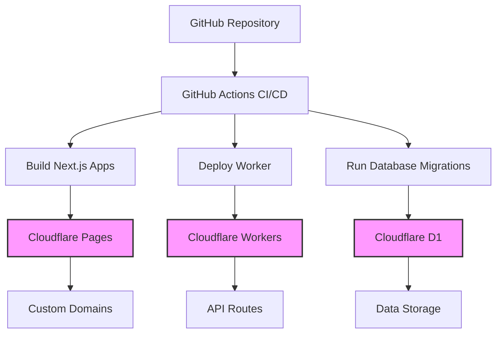

# 🚀 Comprehensive Guide to Deploying Applications on Cloudflare

## Table of Contents

1. [Prerequisites](#prerequisites)
2. [Architecture Overview](#architecture-overview)
3. [Cloudflare Workers Setup](#cloudflare-workers-setup)
4. [Cloudflare Pages Configuration](#cloudflare-pages-configuration)
5. [Cloudflare R2 Object Storage](#cloudflare-r2-object-storage)
6. [Security & Compliance](#security--compliance)
7. [CI/CD Pipeline Integration](#cicd-pipeline-integration)
8. [Monitoring & Maintenance](#monitoring--maintenance)
9. [Performance Optimization](#performance-optimization)
10. [Cost Optimization](#cost-optimization)
11. [Real-World Example: appointmentbooking-monorepo](#real-world-example-appointmentbooking-monorepo)
12. [Troubleshooting](#troubleshooting)
13. [Best Practices](#best-practices)

---

## Prerequisites

### Required Accounts & Tools

1. **Cloudflare Account**: Free tier or higher
2. **GitHub Account**: For version control and CI/CD
3. **Node.js**: Version 18+ with pnpm package manager
4. **Wrangler CLI**: Cloudflare's command-line tool

### Account Setup

```bash
# Install Wrangler CLI globally
npm install -g wrangler

# Verify installation
wrangler --version

# Login to Cloudflare
wrangler login
```

### Environment Variables Setup

Create the following environment variables in your system:

```bash
# Cloudflare Authentication
export CLOUDFLARE_API_TOKEN="your-api-token"
export CLOUDFLARE_ACCOUNT_ID="your-account-id"

# Database & Backend
export DATABASE_URL="your-database-url"
export OPENAI_API_KEY="your-openai-key"

# Third-party Integrations
export PAYSTACK_SECRET_KEY="your-paystack-key"
export SUPERSAAS_API_KEY="your-supersaas-key"
```

---

## Architecture Overview

### Core Components

```
┌─────────────────────────────────────────────────────────┐
│                    Cloudflare Ecosystem                   │
├─────────────────────────────────────────────────────────┤
│  🌐 Cloudflare Pages     │  ⚡ Cloudflare Workers       │
│  - Static Assets         │  - Serverless Functions      │
│  - Next.js Apps          │  - API Endpoints            │
│  - Custom Domains        │  - Business Logic           │
├─────────────────────────────────────────────────────────┤
│  💾 Cloudflare R2        │  🗄️ Cloudflare D1           │
│  - Object Storage        │  - SQLite Database          │
│  - Media Files           │  - Application Data         │
├─────────────────────────────────────────────────────────┤
│  🔒 Cloudflare Security  │  📊 Cloudflare Analytics    │
│  - DDoS Protection       │  - Performance Monitoring   │
│  - SSL/TLS               │  - Usage Analytics          │
│  - WAF Rules             │  - Error Tracking           │
└─────────────────────────────────────────────────────────┘
```

### Deployment Architecture Pattern



---

## Cloudflare Workers Setup

### 1. Initialize Worker Project

```bash
# Create new Worker project
wrangler init worker-name
cd worker-name

# Install dependencies
pnpm install
```

### 2. Configure wrangler.toml

```toml
name = "appointmentbooking-worker"
main = "src/index.ts"
compatibility_date = "2024-01-15"
compatibility_flags = ["nodejs_compat"]

# Environment bindings
[env.production.vars]
ENVIRONMENT = "production"

# Database binding
[[env.production.d1_databases]]
binding = "DB"
database_name = "appointmentbooking-db"
database_id = "your-database-id"

# KV storage (optional)
[[env.production.kv_namespaces]]
binding = "CACHE"
id = "your-kv-namespace-id"

# R2 storage
[[env.production.r2_buckets]]
binding = "STORAGE"
bucket_name = "appointmentbooking-storage"
```

### 3. Worker Code Structure

```typescript
// src/index.ts
export interface Env {
  DB: D1Database;
  CACHE: KVNamespace;
  STORAGE: R2Bucket;
  OPENAI_API_KEY: string;
}

export default {
  async fetch(request: Request, env: Env): Promise<Response> {
    const url = new URL(request.url);
    
    // Route handling
    if (url.pathname === '/api/health') {
      return new Response(JSON.stringify({ status: 'healthy' }), {
        headers: { 'Content-Type': 'application/json' }
      });
    }
    
    if (url.pathname === '/api/book') {
      return handleBooking(request, env);
    }
    
    if (url.pathname.startsWith('/api/tenant/')) {
      return handleTenant(request, env);
    }
    
    return new Response('Not Found', { status: 404 });
  }
};

async function handleBooking(request: Request, env: Env): Promise<Response> {
  const bookingData = await request.json();
  
  // Validate input
  if (!bookingData.tenantId || !bookingData.name) {
    return new Response(JSON.stringify({ error: 'Invalid data' }), {
      status: 400,
      headers: { 'Content-Type': 'application/json' }
    });
  }
  
  // Insert into database
  const result = await env.DB.prepare(
    'INSERT INTO appointments (tenant_id, customer_name, service_id, scheduled_time) VALUES (?, ?, ?, ?)'
  ).bind(
    bookingData.tenantId,
    bookingData.name,
    bookingData.serviceId,
    bookingData.scheduledTime
  ).run();
  
  return new Response(JSON.stringify({ 
    success: true, 
    appointmentId: result.lastInsertRowId 
  }), {
    headers: { 'Content-Type': 'application/json' }
  });
}
```

### 4. Deploy Worker

```bash
# Deploy to production
wrangler deploy

# Deploy to specific environment
wrangler deploy --env staging

# Preview locally
wrangler dev
```

---

## Cloudflare Pages Configuration

### 1. Next.js Configuration

```javascript
// next.config.js
/** @type {import('next').NextConfig} */
const nextConfig = {
  output: 'export',
  trailingSlash: true,
  images: {
    unoptimized: true,
    domains: ['your-domain.com']
  },
  experimental: {
    serverComponentsExternalPackages: ['@supabase/supabase-js']
  }
};

module.exports = nextConfig;
```

### 2. Package.json Scripts

```json
{
  "scripts": {
    "build": "next build",
    "pages:build": "npx @cloudflare/next-on-pages",
    "pages:deploy": "npx wrangler pages deploy .vercel/output/static --project-name=your-app",
    "dev": "next dev",
    "lint": "next lint",
    "type-check": "tsc --noEmit"
  }
}
```

### 3. Environment Variables for Pages

Configure in Cloudflare Dashboard → Workers & Pages → Your Project → Settings → Environment Variables:

```bash
# Production Environment
NEXT_PUBLIC_API_BASE_URL=https://your-worker.your-subdomain.workers.dev
NEXT_PUBLIC_SUPABASE_URL=https://your-project.supabase.co
NEXT_PUBLIC_SUPABASE_ANON_KEY=your-anon-key
NODE_ENV=production

# Staging Environment
NEXT_PUBLIC_API_BASE_URL=https://staging-worker.your-subdomain.workers.dev
NEXT_PUBLIC_SUPABASE_URL=https://staging-project.supabase.co
NODE_ENV=staging
```

### 4. Build Commands by Framework

#### Next.js

```bash
Build Command: npm run pages:build
Build Output Directory: .vercel/output/static
Root Directory: apps/your-app (if monorepo)
```

#### React/Vite

```bash
Build Command: npm run build
Build Output Directory: dist
Node.js Version: 18
```

#### Vue.js

```bash
Build Command: npm run build
Build Output Directory: dist
Node.js Version: 18
```

---

## Cloudflare R2 Object Storage

### 1. Create R2 Bucket

```bash
# Create bucket via API
wrangler r2 bucket create appointmentbooking-storage

# List buckets
wrangler r2 bucket list
```

### 2. Configure R2 in Worker

```typescript
// Upload to R2
async function uploadToR2(env: Env, file: File, key: string): Promise<Response> {
  const uploadResult = await env.STORAGE.put(key, file, {
    httpMetadata: {
      contentType: file.type,
      contentDisposition: `inline; filename="${file.name}"`
    }
  });
  
  return new Response(JSON.stringify({ 
    key: uploadResult.key,
    size: uploadResult.size,
    uploaded: uploadResult.uploaded
  }), {
    headers: { 'Content-Type': 'application/json' }
  });
}

// Download from R2
async function downloadFromR2(env: Env, key: string): Promise<Response> {
  const object = await env.STORAGE.get(key);
  
  if (!object) {
    return new Response('Not Found', { status: 404 });
  }
  
  return new Response(object.body, {
    headers: {
      'Content-Type': object.httpMetadata?.contentType || 'application/octet-stream',
      'Content-Length': object.size.toString()
    }
  });
}
```

### 3. Frontend Integration

```typescript
// utils/r2-client.ts
export class R2Client {
  private baseUrl: string;
  
  constructor(workerUrl: string) {
    this.baseUrl = `${workerUrl}/api/storage`;
  }
  
  async uploadFile(file: File, path: string): Promise<string> {
    const formData = new FormData();
    formData.append('file', file);
    formData.append('path', path);
    
    const response = await fetch(`${this.baseUrl}/upload`, {
      method: 'POST',
      body: formData
    });
    
    const result = await response.json();
    return result.url;
  }
  
  async getSignedUrl(key: string): Promise<string> {
    const response = await fetch(`${this.baseUrl}/sign?key=${key}`);
    const result = await response.json();
    return result.url;
  }
}
```

### 4. R2 Pricing Optimization

```bash
# Storage classes for cost optimization
STANDARD     # Frequently accessed files (< 1GB/month: $0.015/GB)
INFREQUENT   # Occasionally accessed files (< 1GB/month: $0.009/GB)
ARCHIVE      # Long-term storage (< 1GB/month: $0.004/GB)
```

---

## Security & Compliance

### 1. SSL/TLS Configuration

```javascript
// Security headers in Worker
const securityHeaders = {
  'Strict-Transport-Security': 'max-age=31536000; includeSubDomains',
  'X-Content-Type-Options': 'nosniff',
  'X-Frame-Options': 'DENY',
  'X-XSS-Protection': '1; mode=block',
  'Referrer-Policy': 'strict-origin-when-cross-origin',
  'Content-Security-Policy': "default-src 'self'; script-src 'self' 'unsafe-inline'"
};

function addSecurityHeaders(response: Response): Response {
  const newHeaders = new Headers(response.headers);
  Object.entries(securityHeaders).forEach(([key, value]) => {
    newHeaders.set(key, value);
  });
  return new Response(response.body, {
    status: response.status,
    statusText: response.statusText,
    headers: newHeaders
  });
}
```

### 2. WAF (Web Application Firewall)

Configure in Cloudflare Dashboard → Security → WAF:

```bash
# Custom Rules
# Block suspicious user agents
(http.user_agent contains "bot" and not cf.threat_score < 10)

# Rate limiting
(http.request.uri.path contains "/api/" and rate(5m) > 100)

# Geographic blocking (if needed)
(not ip.geoip.country in {"US" "CA" "GB"})
```

### 3. DDoS Protection

```bash
# Always On Protection
# - L3/L4 DDoS Protection
# - L7 HTTP DDoS Protection  
# - Bot Fight Mode
# - Challenge Passage
```

### 4. Data Protection

```sql
-- Row Level Security in D1
CREATE TABLE appointments (
  id INTEGER PRIMARY KEY AUTOINCREMENT,
  tenant_id TEXT NOT NULL,
  customer_email TEXT NOT NULL,
  created_at DATETIME DEFAULT CURRENT_TIMESTAMP
);

-- Enable RLS
ALTER TABLE appointments ENABLE ROW LEVEL SECURITY;

-- Policy: Users can only see their tenant's data
CREATE POLICY tenant_isolation ON appointments
  FOR ALL TO anon
  USING (tenant_id = current_setting('app.current_tenant')::text);
```

### 5. Compliance Features

```bash
# Cloudflare Compliance Programs
SOC 2 Type II     # Annual audit for security controls
ISO 27001        # Information security management
GDPR             # EU data protection compliance
HIPAA            # Healthcare data protection (Enterprise)
PCI DSS          # Payment card industry compliance (Enterprise)
```

---

## CI/CD Pipeline Integration

### 1. GitHub Actions Workflow

```yaml
# .github/workflows/cloudflare-deploy.yml
name: Deploy to Cloudflare

on:
  push:
    branches: [main]
  pull_request:
    branches: [main]

jobs:
  deploy:
    runs-on: ubuntu-latest
    
    steps:
    - uses: actions/checkout@v4
    
    - name: Setup Node.js
      uses: actions/setup-node@v4
      with:
        node-version: '18'
        cache: 'pnpm'
    
    - name: Install pnpm
      run: npm install -g pnpm
    
    - name: Install dependencies
      run: pnpm install --frozen-lockfile
    
    - name: Build applications
      run: |
        pnpm run build
        pnpm run pages:build
    
    - name: Deploy Worker
      uses: cloudflare/wrangler-action@v3
      with:
        apiToken: ${{ secrets.CLOUDFLARE_API_TOKEN }}
        accountId: ${{ secrets.CLOUDFLARE_ACCOUNT_ID }}
        command: deploy
    
    - name: Deploy Pages
      uses: cloudflare/wrangler-action@v3
      with:
        apiToken: ${{ secrets.CLOUDFLARE_API_TOKEN }}
        accountId: ${{ secrets.CLOUDFLARE_ACCOUNT_ID }}
        command: pages deploy .vercel/output/static --project-name=booking-app
    
    - name: Run database migrations
      run: |
        wrangler d1 execute appointmentbooking-db --remote --file=scripts/migrations/latest.sql
    
    - name: Run tests
      run: pnpm run test
    
    - name: Audit deployment
      run: node scripts/cloudflare-audit.js
```

### 2. Environment-specific Deployments

```yaml
# Staging deployment
name: Deploy to Staging

on:
  push:
    branches: [develop]

jobs:
  deploy-staging:
    runs-on: ubuntu-latest
    environment: staging
    
    steps:
    - uses: actions/checkout@v4
    
    - name: Deploy to Staging
      uses: cloudflare/wrangler-action@v3
      with:
        apiToken: ${{ secrets.CLOUDFLARE_API_TOKEN }}
        accountId: ${{ secrets.CLOUDFLARE_ACCOUNT_ID }}
        command: deploy --env staging
```

### 3. GitHub Secrets Configuration

Add these secrets in GitHub repository settings:

```bash
CLOUDFLARE_API_TOKEN        # Your Cloudflare API token
CLOUDFLARE_ACCOUNT_ID       # Your Cloudflare account ID
SUPABASE_SERVICE_ROLE_KEY   # Supabase service role key
OPENAI_API_KEY             # OpenAI API key
PAYSTACK_SECRET_KEY        # PayStack secret key
```

---

## Monitoring & Maintenance

### 1. Cloudflare Analytics Setup

```javascript
// Add to your HTML/Next.js app
<script defer src='https://static.cloudflareinsights.com/beacon.min.js' 
        data-cf-beacon='{"token": "your-analytics-token"}'></script>
```

### 2. Worker Monitoring

```typescript
// Logging in Workers
export default {
  async fetch(request: Request, env: Env): Promise<Response> {
    const startTime = Date.now();
    
    try {
      const response = await handleRequest(request, env);
      const duration = Date.now() - startTime;
      
      // Log metrics
      console.log(JSON.stringify({
        timestamp: new Date().toISOString(),
        method: request.method,
        url: request.url,
        status: response.status,
        duration: duration,
        userAgent: request.headers.get('user-agent')
      }));
      
      return response;
    } catch (error) {
      console.error('Worker error:', error);
      return new Response('Internal Server Error', { status: 500 });
    }
  }
};
```

### 3. Uptime Monitoring

```yaml
# monitoring-alerts.yaml (Cloudflare monitoring)
type: http
name: "Worker Health Check"
url: "https://your-worker.your-subdomain.workers.dev/api/health"
port: 443
method: GET
timeout: 30
retries: 3
```

### 4. Error Tracking

```typescript
// Error boundaries for Next.js
class ErrorBoundary extends React.Component {
  constructor(props) {
    super(props);
    this.state = { hasError: false };
  }
  
  static getDerivedStateFromError(error) {
    return { hasError: true };
  }
  
  componentDidCatch(error, errorInfo) {
    // Send to error tracking service
    console.error('Error caught by boundary:', error, errorInfo);
  }
  
  render() {
    if (this.state.hasError) {
      return <h1>Something went wrong. Please try again.</h1>;
    }
    return this.props.children;
  }
}
```

---

## Performance Optimization

### 1. Caching Strategy

```typescript
// Worker-level caching
const CACHE_TTL = {
  static: 60 * 60 * 24 * 30,    // 30 days for static content
  api: 60 * 5,                  // 5 minutes for API responses
  dynamic: 0                    // No cache for dynamic content
};

async function cacheResponse(request: Request, data: any, ttl: number): Promise<Response> {
  const cacheKey = new Request(request.url, request);
  const cache = caches.default;
  
  const response = new Response(JSON.stringify(data), {
    headers: {
      'Content-Type': 'application/json',
      'Cache-Control': `public, max-age=${ttl}`,
      'ETag': `"${Date.now()}"`
    }
  });
  
  await cache.put(cacheKey, response.clone());
  return response;
}
```

### 2. Database Query Optimization

```sql
-- Use indexes for frequently queried columns
CREATE INDEX idx_appointments_tenant_date ON appointments(tenant_id, scheduled_time);
CREATE INDEX idx_customers_email ON customers(email);

-- Optimize queries with proper SELECT
-- Instead of: SELECT * FROM appointments WHERE tenant_id = ?
-- Use: SELECT id, customer_name, scheduled_time FROM appointments WHERE tenant_id = ?
```

### 3. Image Optimization

```javascript
// next.config.js - Image optimization for Cloudflare
const nextConfig = {
  images: {
    formats: ['image/webp', 'image/avif'],
    minimumCacheTTL: 60 * 60 * 24 * 30, // 30 days
    deviceSizes: [640, 750, 828, 1080, 1200, 1920, 2048, 3840],
    imageSizes: [16, 32, 48, 64, 96, 128, 256, 384]
  }
};
```

### 4. Bundle Optimization

```javascript
// Reduce bundle size
// Use dynamic imports
const BookingForm = dynamic(() => import('./BookingForm'), {
  loading: () => <p>Loading...</p>
});

// Code splitting
import { lazy, Suspense } from 'react';

const Dashboard = lazy(() => import('./Dashboard'));

function App() {
  return (
    <Suspense fallback={<div>Loading...</div>}>
      <Dashboard />
    </Suspense>
  );
}
```

---

## Cost Optimization

### 1. Resource Usage Optimization

```bash
# Monitor resource usage
wrangler tail --format=json | jq '.cpuTime, .memory, .duration'

# Optimize Worker performance
# - Minimize database queries
# - Use efficient algorithms
# - Implement proper caching
# - Avoid blocking operations
```

### 2. R2 Storage Optimization

```typescript
// Implement lifecycle policies
const LIFECYCLE_CONFIG = {
  rules: [
    {
      id: 'delete-old-uploads',
      status: 'Enabled',
      filter: { prefix: 'temp/' },
      expiration: { days: 7 }
    }
  ]
};

// Compress images before upload
async function optimizeImage(file: File): Promise<File> {
  const canvas = document.createElement('canvas');
  const ctx = canvas.getContext('2d');
  const img = new Image();
  
  return new Promise((resolve) => {
    img.onload = () => {
      canvas.width = img.width;
      canvas.height = img.height;
      ctx?.drawImage(img, 0, 0);
      
      canvas.toBlob((blob) => {
        resolve(new File([blob!], file.name, { type: 'image/webp' }));
      }, 'image/webp', 0.8);
    };
    img.src = URL.createObjectURL(file);
  });
}
```

### 3. Database Cost Optimization

```sql
-- Use appropriate data types
-- Instead of TEXT for IDs, use CHAR(36)
-- Use INTEGER for numbers instead of TEXT
-- Implement proper indexing

-- Archive old data
CREATE TABLE appointments_archive AS 
SELECT * FROM appointments 
WHERE created_at < datetime('now', '-2 years');

DELETE FROM appointments 
WHERE created_at < datetime('now', '-2 years');
```

### 4. Traffic Optimization

```javascript
// Implement intelligent caching
const shouldCache = (url: string, response: Response): boolean => {
  // Cache static assets
  if (url.includes('/static/') || url.includes('.css') || url.includes('.js')) {
    return true;
  }
  
  // Cache API responses with low update frequency
  if (url.includes('/api/services') || url.includes('/api/tenants')) {
    return response.status === 200;
  }
  
  return false;
};
```

---

## Real-World Example: appointmentbooking-monorepo

### Project Architecture

```
appointmentbooking-monorepo/
├── apps/
│   ├── booking/           # Customer booking interface
│   ├── dashboard/         # Admin dashboard
│   └── marketing/         # Marketing site
├── packages/
│   ├── worker/            # Cloudflare Worker (API)
│   ├── ui/               # Shared UI components
│   └── auth/             # Authentication logic
├── scripts/
│   ├── migrations/       # Database migrations
│   └── deployment/       # Deployment scripts
└── docs/                 # Documentation
```

### Deployment Configuration

```toml
# packages/worker/wrangler.toml
name = "appointmentbooking-worker"
main = "src/index.ts"
compatibility_date = "2024-01-15"
compatibility_flags = ["nodejs_compat"]

[env.production.vars]
ENVIRONMENT = "production"

[[env.production.d1_databases]]
binding = "DB"
database_name = "appointmentbooking-db"
database_id = "a1b2c3d4-e5f6-7890-abcd-ef1234567890"

[[env.production.r2_buckets]]
binding = "STORAGE"
bucket_name = "appointmentbooking-storage"
```

### Database Schema

```sql
-- D1 Database schema for appointment booking
CREATE TABLE tenants (
  id TEXT PRIMARY KEY,
  name TEXT NOT NULL,
  slug TEXT UNIQUE NOT NULL,
  logo_url TEXT,
  config TEXT,
  created_at DATETIME DEFAULT CURRENT_TIMESTAMP
);

CREATE TABLE services (
  id TEXT PRIMARY KEY,
  tenant_id TEXT NOT NULL,
  name TEXT NOT NULL,
  description TEXT,
  duration INTEGER NOT NULL,
  price DECIMAL(10,2) NOT NULL,
  FOREIGN KEY (tenant_id) REFERENCES tenants(id)
);

CREATE TABLE appointments (
  id TEXT PRIMARY KEY,
  tenant_id TEXT NOT NULL,
  customer_name TEXT NOT NULL,
  customer_email TEXT NOT NULL,
  customer_phone TEXT,
  service_id TEXT NOT NULL,
  scheduled_time DATETIME NOT NULL,
  status TEXT DEFAULT 'confirmed',
  created_at DATETIME DEFAULT CURRENT_TIMESTAMP,
  FOREIGN KEY (tenant_id) REFERENCES tenants(id),
  FOREIGN KEY (service_id) REFERENCES services(id)
);
```

### Worker API Implementation

```typescript
// packages/worker/src/index.ts
export interface Env {
  DB: D1Database;
  STORAGE: R2Bucket;
  OPENAI_API_KEY: string;
}

export default {
  async fetch(request: Request, env: Env): Promise<Response> {
    const url = new URL(request.url);
    const path = url.pathname;
    
    try {
      // Health check
      if (path === '/health') {
        return new Response(JSON.stringify({ 
          status: 'healthy',
          timestamp: new Date().toISOString()
        }), {
          headers: { 'Content-Type': 'application/json' }
        });
      }
      
      // Booking endpoints
      if (path === '/api/book' && request.method === 'POST') {
        return await handleBooking(request, env);
      }
      
      // Tenant data endpoints
      if (path.startsWith('/api/tenant/')) {
        return await handleTenantData(request, env);
      }
      
      // Dashboard endpoints
      if (path.startsWith('/api/dashboard/')) {
        return await handleDashboard(request, env);
      }
      
      return new Response('Not Found', { status: 404 });
    } catch (error) {
      console.error('Worker error:', error);
      return new Response(JSON.stringify({ 
        error: 'Internal server error' 
      }), {
        status: 500,
        headers: { 'Content-Type': 'application/json' }
      });
    }
  }
};

async function handleBooking(request: Request, env: Env): Promise<Response> {
  const bookingData = await request.json();
  
  // Validate required fields
  if (!bookingData.tenantId || !bookingData.customerName || 
      !bookingData.serviceId || !bookingData.scheduledTime) {
    return new Response(JSON.stringify({ 
      error: 'Missing required fields' 
    }), {
      status: 400,
      headers: { 'Content-Type': 'application/json' }
    });
  }
  
  // Check availability
  const availabilityCheck = await env.DB.prepare(
    'SELECT COUNT(*) as count FROM appointments WHERE tenant_id = ? AND scheduled_time = ?'
  ).bind(bookingData.tenantId, bookingData.scheduledTime).first();
  
  if (availabilityCheck && availabilityCheck.count > 0) {
    return new Response(JSON.stringify({ 
      error: 'Time slot not available' 
    }), {
      status: 409,
      headers: { 'Content-Type': 'application/json' }
    });
  }
  
  // Create appointment
  const result = await env.DB.prepare(
    'INSERT INTO appointments (tenant_id, customer_name, customer_email, customer_phone, service_id, scheduled_time) VALUES (?, ?, ?, ?, ?, ?)'
  ).bind(
    bookingData.tenantId,
    bookingData.customerName,
    bookingData.customerEmail,
    bookingData.customerPhone,
    bookingData.serviceId,
    bookingData.scheduledTime
  ).run();
  
  // Send confirmation (async)
  sendConfirmationEmail(bookingData, env).catch(console.error);
  
  return new Response(JSON.stringify({ 
    success: true,
    appointmentId: result.lastInsertRowId,
    message: 'Booking created successfully'
  }), {
    headers: { 'Content-Type': 'application/json' }
  });
}
```

### Environment Variables

```bash
# Production environment variables
NODE_ENV=production
NEXT_PUBLIC_API_BASE_URL=https://appointmentbooking-worker.your-subdomain.workers.dev
NEXT_PUBLIC_SUPABASE_URL=https://your-project.supabase.co
SUPABASE_SERVICE_ROLE_KEY=your-service-role-key
OPENAI_API_KEY=sk-your-openai-key
PAYSTACK_SECRET_KEY=sk_test_your-paystack-key
CLOUDFLARE_API_TOKEN=your-cloudflare-token
```

### Deployment Scripts

```javascript
// scripts/deploy-production.js
const { execSync } = require('child_process');

async function deployToProduction() {
  console.log('🚀 Starting production deployment...');
  
  try {
    // 1. Install dependencies
    console.log('📦 Installing dependencies...');
    execSync('pnpm install --frozen-lockfile', { stdio: 'inherit' });
    
    // 2. Build applications
    console.log('🔨 Building applications...');
    execSync('pnpm run build', { stdio: 'inherit' });
    execSync('pnpm run pages:build', { stdio: 'inherit' });
    
    // 3. Deploy Worker
    console.log('⚡ Deploying Worker...');
    execSync('wrangler deploy', { stdio: 'inherit' });
    
    // 4. Deploy Pages
    console.log('📱 Deploying Pages...');
    execSync('wrangler pages deploy .vercel/output/static --project-name=appointmentbooking', { 
      stdio: 'inherit' 
    });
    
    // 5. Run migrations
    console.log('🗄️ Running database migrations...');
    execSync('wrangler d1 execute appointmentbooking-db --remote --file=scripts/migrations/latest.sql', { 
      stdio: 'inherit' 
    });
    
    // 6. Verify deployment
    console.log('🔍 Verifying deployment...');
    execSync('node scripts/cloudflare-audit.js', { stdio: 'inherit' });
    
    console.log('✅ Production deployment completed successfully!');
  } catch (error) {
    console.error('❌ Deployment failed:', error.message);
    process.exit(1);
  }
}

deployToProduction();
```

### Domain Configuration

```bash
# Custom domains setup
Main Website: instylehairboutique.co.za → Worker
Booking App: shop.instylehairboutique.co.za → Pages
Dashboard: dashboard.instylehairboutique.co.za → Pages
API: api.instylehairboutique.co.za → Worker (subdomain)
```

---

## Troubleshooting

### Common Issues & Solutions

#### 1. Worker Deployment Failures

```bash
# Check Worker logs
wrangler tail

# Verify environment variables
wrangler secret list

# Test locally first
wrangler dev --local
```

#### 2. Pages Build Issues

```bash
# Clear build cache
rm -rf .next .vercel node_modules
pnpm install
pnpm run build

# Check build output
ls -la .vercel/output/static
```

#### 3. Database Connection Issues

```bash
# Test D1 connection
wrangler d1 execute appointmentbooking-db --command="SELECT 1"

# Check migration status
wrangler d1 execute appointmentbooking-db --command="SELECT name FROM sqlite_master WHERE type='table'"
```

#### 4. Domain Configuration Issues

```bash
# Verify DNS settings
dig your-domain.com

# Check SSL certificate status
curl -I https://your-domain.com

# Test custom domain
wrangler pages domain list --project-name=your-project
```

#### 5. Performance Issues

```javascript
// Add performance monitoring
const performanceTimer = {
  start: () => performance.now(),
  end: (startTime, label) => {
    const duration = performance.now() - startTime;
    console.log(`${label}: ${duration.toFixed(2)}ms`);
    return duration;
  }
};

// Usage in Worker
const timer = performanceTimer.start();
// ... your code ...
performanceTimer.end(timer, 'API response time');
```

---

## Best Practices

### 1. Security Best Practices

```typescript
// Input validation
import { z } from 'zod';

const BookingSchema = z.object({
  tenantId: z.string().uuid(),
  customerName: z.string().min(2).max(100),
  customerEmail: z.string().email(),
  serviceId: z.string().uuid(),
  scheduledTime: z.string().datetime()
});

// Use in Worker
const bookingData = BookingSchema.parse(await request.json());
```

### 2. Error Handling

```typescript
// Comprehensive error handling
export class AppError extends Error {
  constructor(
    message: string,
    public statusCode: number = 500,
    public code?: string
  ) {
    super(message);
    this.name = 'AppError';
  }
}

// Usage
try {
  const result = await riskyOperation();
  return new Response(JSON.stringify(result));
} catch (error) {
  if (error instanceof AppError) {
    return new Response(JSON.stringify({ 
      error: error.message,
      code: error.code 
    }), { status: error.statusCode });
  }
  
  // Log unexpected errors
  console.error('Unexpected error:', error);
  return new Response(JSON.stringify({ 
    error: 'Internal server error' 
  }), { status: 500 });
}
```

### 3. Database Optimization

```sql
-- Use prepared statements
-- Implement proper indexing
-- Avoid SELECT *
-- Use pagination for large datasets

-- Example: Paginated query
SELECT id, customer_name, scheduled_time, status
FROM appointments 
WHERE tenant_id = ? AND created_at > ?
ORDER BY scheduled_time DESC
LIMIT 20 OFFSET ?;
```

### 4. Caching Strategy

```typescript
// Multi-level caching
const cacheStrategy = {
  static: '1 year',      // Static assets
  api: '5 minutes',      // API responses
  dynamic: 'no-cache'    // User-specific content
};

// Implement in Worker
const getCachedResponse = async (key: string, ttl: number): Promise<Response | null> => {
  const cache = caches.default;
  const cached = await cache.match(key);
  
  if (cached) {
    const age = Date.now() - Date.parse(cached.headers.get('date') || '');
    if (age < ttl * 1000) {
      return cached;
    }
  }
  return null;
};
```

### 5. Monitoring & Alerting

```typescript
// Structured logging
const logger = {
  info: (message: string, data?: any) => {
    console.log(JSON.stringify({ level: 'info', message, data, timestamp: new Date().toISOString() }));
  },
  error: (message: string, error?: any) => {
    console.error(JSON.stringify({ level: 'error', message, error: error?.message, timestamp: new Date().toISOString() }));
  },
  warn: (message: string, data?: any) => {
    console.warn(JSON.stringify({ level: 'warn', message, data, timestamp: new Date().toISOString() }));
  }
};

// Usage
logger.info('Booking created', { appointmentId, tenantId, customerEmail });
logger.error('Database error', error);
```

---

## Conclusion

This comprehensive guide provides a complete roadmap for deploying applications on Cloudflare's ecosystem. By following these best practices and leveraging Cloudflare's powerful features, you can build scalable, secure, and cost-effective applications.

### Key Takeaways

1. **Architecture**: Choose the right Cloudflare services for your use case
2. **Security**: Implement proper security measures from the start
3. **Performance**: Optimize for global edge deployment
4. **Monitoring**: Set up comprehensive monitoring and alerting
5. **Cost**: Monitor usage and optimize for cost efficiency
6. **Reliability**: Implement proper error handling and recovery

### Next Steps

1. Set up your Cloudflare account and configure initial projects
2. Implement the deployment pipeline with CI/CD
3. Monitor performance and costs
4. Iterate and optimize based on real-world usage

---

**📚 Additional Resources:**

- [Cloudflare Documentation](https://developers.cloudflare.com/)
- [Workers API Reference](https://developers.cloudflare.com/workers/runtime-apis/)
- [Pages Documentation](https://developers.cloudflare.com/pages/)
- [D1 Database Guide](https://developers.cloudflare.com/d1/)
- [R2 Storage Guide](https://developers.cloudflare.com/r2/)

**🎯 Quick Reference:**

- Worker deployment: `wrangler deploy`
- Pages deployment: `wrangler pages deploy`
- Database operations: `wrangler d1 execute`
- View logs: `wrangler tail`
- Local development: `wrangler dev`
