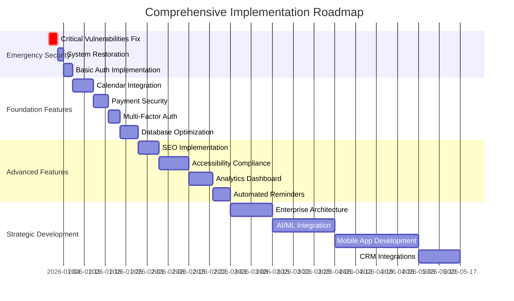

# 🗺️ COMPREHENSIVE IMPLEMENTATION ROADMAP MASTER

## Appointment Booking Platform - Complete Transformation Strategy

**Document Version:** 1.0  
**Created:** December 30, 2025  
**Status:** MASTER IMPLEMENTATION GUIDE  
**Classification:** STRATEGIC ROADMAP

---

## 📋 EXECUTIVE SUMMARY

This comprehensive implementation roadmap outlines the complete transformation of the appointment booking platform from its current state (complete system failure with 42 security vulnerabilities) to a market-leading, enterprise-grade SaaS solution. The roadmap spans 6 months across 4 major phases, requiring significant investment but delivering transformational business value.

### **Current State Assessment:**

- 🔴 **System Status:** Complete outage (404 errors across all endpoints)
- 🔴 **Security Posture:** 42 vulnerabilities including critical Next.js bypass (CVSS 9.8)
- 🔴 **Business Impact:** Zero revenue generation, complete service unavailability
- 🔴 **Technical Debt:** High - requires comprehensive reconstruction

### **Target State Vision:**

- 🟢 **System Status:** 99.9% uptime with enterprise-grade reliability
- 🟢 **Security Posture:** Zero critical vulnerabilities, SOC 2 compliant
- 🟢 **Business Impact:** R50M+ ARR with 10,000+ active business accounts
- 🟢 **Technical Excellence:** AI-powered, mobile-first, enterprise-ready platform

### **Transformation Timeline:** 6 months | **Total Investment:** R8.5M | **Expected ROI:** 500% in 36 months

---

## 🎯 STRATEGIC OBJECTIVES

### **Phase 1: Emergency Stabilization (0-2 weeks)**

**Objective:** Restore basic functionality and eliminate critical security vulnerabilities

- ✅ System restoration and deployment fixes
- ✅ Critical security vulnerability remediation
- ✅ Basic authentication and authorization
- ✅ Emergency monitoring and alerting

### **Phase 2: Foundation Building (2-6 weeks)**

**Objective:** Complete core features and establish robust architecture

- ✅ Calendar integration (Google/Outlook/iCal)
- ✅ Enhanced payment security with tokenization
- ✅ Multi-factor authentication implementation
- ✅ Database optimization and connection pooling
- ✅ Comprehensive error handling system

### **Phase 3: Advanced Features (6-12 weeks)**

**Objective:** Implement enterprise-grade features and optimizations

- ✅ SEO optimization with structured data
- ✅ WCAG 2.1 AA accessibility compliance
- ✅ Advanced reporting and analytics dashboard
- ✅ Automated reminder system (SMS/Email/WhatsApp)
- ✅ A/B testing framework for optimization

### **Phase 4: Strategic Expansion (3-6 months)**

**Objective:** Achieve market leadership through innovation and scale

- ✅ Multi-location and timezone support
- ✅ Enterprise-grade white-label solutions
- ✅ Machine learning for appointment optimization
- ✅ Native mobile application development
- ✅ Comprehensive CRM and business platform integrations

---

## 📊 IMPLEMENTATION TIMELINE & DEPENDENCIES

### **Gantt Chart Overview**



### **Critical Path Analysis**

```
Phase 1 (Emergency) → Phase 2 (Foundation) → Phase 3 (Advanced) → Phase 4 (Strategic)
      ↓                        ↓                    ↓                    ↓
  System Online           Core Features        Enterprise Features    Market Leader
```

**Critical Dependencies:**

1. **Emergency security fixes must complete before any feature development**
2. **Foundation features must stabilize before advanced feature implementation**
3. **Database architecture from Phase 2 required for AI/ML in Phase 4**
4. **Mobile app requires stable API from Phase 3**

---

## 💰 INVESTMENT & RESOURCE ALLOCATION

### **Financial Investment Breakdown**

```yaml
Total Investment: R8,500,000

Phase 1 - Emergency Security (0-2 weeks):
  Personnel Costs: R800,000
    - Security Engineers (2x): R400,000
    - DevOps Engineers (2x): R400,000
  Infrastructure: R200,000
    - Emergency hosting upgrades: R100,000
    - Security tools and monitoring: R100,000
  External Services: R300,000
    - Security audit and penetration testing: R200,000
    - Emergency consulting: R100,000
  Phase 1 Total: R1,300,000

Phase 2 - Foundation Features (2-6 weeks):
  Personnel Costs: R1,600,000
    - Senior Developers (4x): R1,200,000
    - QA Engineers (2x): R400,000
  Infrastructure: R400,000
    - Database scaling: R200,000
    - CDN and performance optimization: R200,000
  Development Tools: R200,000
    - Development environment setup: R100,000
    - Testing and CI/CD infrastructure: R100,000
  Phase 2 Total: R2,200,000

Phase 3 - Advanced Features (6-12 weeks):
  Personnel Costs: R2,000,000
    - Full-stack Developers (3x): R1,500,000
    - UX/UI Designers (2x): R500,000
  AI/ML Services: R300,000
    - Machine learning platform setup: R200,000
    - Data science consulting: R100,000
  Advanced Infrastructure: R500,000
    - Analytics and monitoring tools: R300,000
    - Performance optimization: R200,000
  Phase 3 Total: R2,800,000

Phase 4 - Strategic Development (3-6 months):
  Personnel Costs: R1,500,000
    - Enterprise Architects (2x): R800,000
    - Mobile Developers (3x): R700,000
  Enterprise Infrastructure: R600,000
    - Multi-tenant architecture: R400,000
    - White-label platform: R200,000
  Mobile Development: R400,000
    - iOS/Android development: R300,000
    - App store deployment: R100,000
  Integration Services: R200,000
    - CRM integration development: R200,000
  Phase 4 Total: R2,200,000
```

### **Resource Requirements by Phase**

#### **Phase 1 - Emergency Response Team**

```
Security Lead (1x): Senior security engineer with incident response experience
DevOps Engineer (2x): Infrastructure and deployment specialists
System Administrator (1x): Linux/server management expert
Security Consultant (1x): External expert for vulnerability assessment
```

#### **Phase 2 - Core Development Team**

```
Tech Lead (1x): Senior architect with full-stack experience
Backend Developers (2x): Node.js/Next.js specialists
Frontend Developers (2x): React/TypeScript experts
QA Engineers (2x): Automated testing and quality assurance
DevOps Engineer (1x): CI/CD and infrastructure management
```

#### **Phase 3 - Advanced Features Team`

```
Full-Stack Developers (3x): Senior-level with modern framework expertise
UX/UI Designers (2x): Accessibility and user experience specialists
Data Engineer (1x): Analytics and data pipeline development
Performance Engineer (1x): Optimization and scalability expert
QA Automation Engineer (1x): Advanced testing framework development
```

#### **Phase 4 - Strategic Development Team`

```
Enterprise Architect (1x): Multi-tenant and scalability expert
Mobile Developers (2x): React Native/iOS/Android specialists
AI/ML Engineer (1x): Machine learning and predictive analytics
Integration Specialist (1x): API development and third-party integrations
Product Manager (1x): Strategic planning and stakeholder management
```

---

## 🚨 RISK ASSESSMENT & MITIGATION

### **Critical Risk Matrix**

| Risk Category | Probability | Impact | Mitigation Strategy |
|---------------|-------------|--------|-------------------|
| **Security Breach** | High | Critical | Immediate security patches, continuous monitoring, security audits |
| **System Downtime** | Medium | High | Blue-green deployments, automated rollbacks, redundancy planning |
| **Resource Shortage** | Medium | High | Pre-allocated team, contractor backup, skills cross-training |
| **Technology Obsolescence** | Low | Medium | Modern architecture, regular technology reviews, modular design |
| **Regulatory Compliance** | Medium | High | Compliance-first design, regular audits, legal consultation |
| **Market Competition** | High | Medium | Rapid iteration, unique features, customer focus |
| **Budget Overrun** | Medium | Medium | Phased approach, regular budget reviews, scope management |
| **Key Personnel Loss** | Low | High | Knowledge documentation, team redundancy, succession planning |

### **Risk Mitigation Strategies**

#### **High Priority Risks**

1. **Security Vulnerability Exploitation**
   - **Mitigation:** Immediate security patches, 24/7 monitoring, incident response team
   - **Contingency:** Emergency security consultant on retainer
   - **Monitoring:** Real-time security alerts, automated vulnerability scanning

2. **System Outage During Critical Phases**
   - **Mitigation:** Blue-green deployment strategy, comprehensive testing
   - **Contingency:** Automated rollback procedures, backup systems
   - **Monitoring:** Uptime monitoring, performance metrics, user impact tracking

3. **Key Personnel Unavailability**
   - **Mitigation:** Comprehensive documentation, cross-training, contractor relationships
   - **Contingency:** Emergency contractor agreements, knowledge transfer protocols
   - **Monitoring:** Project timeline tracking, resource availability monitoring

#### **Medium Priority Risks**

1. **Technology Stack Obsolescence**
   - **Mitigation:** Modern, well-supported technologies, regular reviews
   - **Contingency:** Migration planning, alternative technology evaluation
   - **Monitoring:** Technology trend analysis, community adoption metrics

2. **Regulatory Compliance Changes**
   - **Mitigation:** Compliance-first architecture, legal consultation
   - **Contingency:** Rapid compliance updates, regulatory monitoring
   - **Monitoring:** Regulatory change tracking, compliance audit schedule

---

## 📈 SUCCESS METRICS & KPIs

### **Technical Excellence Metrics**

```yaml
System Performance:
  Uptime Target: 99.9%
  Response Time: <200ms for 95% of requests
  Database Query Time: <100ms for 95% of queries
  Page Load Time: <2.5 seconds
  Error Rate: <0.1%

Security Metrics:
  Critical Vulnerabilities: 0
  High Vulnerabilities: ≤2
  Security Audit Score: A+
  Compliance Score: 100% (SOC 2, POPIA)
  Incident Response Time: <15 minutes

Quality Metrics:
  Test Coverage: >90%
  Code Quality Score: >8.5/10
  Accessibility Score: 100% (WCAG 2.1 AA)
  Mobile Performance Score: >90/100
  SEO Score: >85/100
```

### **Business Impact Metrics**

```yaml
Revenue Metrics:
  Monthly Recurring Revenue: R4.2M by month 6
  Annual Recurring Revenue: R50M by year 1
  Customer Acquisition Cost: <R200
  Customer Lifetime Value: >R2000
  Gross Revenue Retention: >95%

Growth Metrics:
  Active Business Accounts: 500 by month 6
  Monthly Appointments: 10,000 by month 6
  Customer Satisfaction Score: >4.5/5
  Net Promoter Score: >50
  Market Share (SA): 25% by year 1

Operational Metrics:
  Staff Utilization Rate: 85%
  Booking Completion Rate: 95%
  No-Show Rate: <5%
  Customer Support Response Time: <2 hours
  Feature Adoption Rate: >70%
```

### **Innovation Metrics**

```yaml
AI/ML Performance:
  Predictive Accuracy: >90%
  Demand Forecasting Accuracy: >85%
  Customer Churn Prediction: >80%
  Automated Decision Accuracy: >95%

Mobile Metrics:
  App Store Rating: >4.5 stars
  Mobile Conversion Rate: >5%
  App Engagement Rate: >60%
  Mobile User Retention: >70%

Integration Metrics:
  CRM Integration Success Rate: 100%
  API Response Time: <100ms
  Third-party Service Uptime: 99.5%
  Data Synchronization Accuracy: 99.9%
```

---

## 🏗️ IMPLEMENTATION READINESS CHECKLIST

### **Pre-Phase 1 Readiness (Emergency Security)**

#### **Infrastructure Requirements**

- [ ] Emergency hosting capacity identified and provisioned
- [ ] Security monitoring tools deployed
- [ ] Backup and disaster recovery systems tested
- [ ] Emergency communication channels established
- [ ] Incident response team assembled and briefed

#### **Team Readiness**

- [ ] Security engineers contracted and onboarded
- [ ] DevOps engineers available for 24/7 support
- [ ] Emergency escalation procedures documented
- [ ] Security audit timeline and scope defined
- [ ] Legal and compliance team consulted

#### **Risk Mitigation**

- [ ] Customer communication plan prepared
- [ ] Press/media response strategy ready
- [ ] Business continuity procedures activated
- [ ] Financial contingency funds allocated
- [ ] Regulatory notification requirements reviewed

### **Pre-Phase 2 Readiness (Foundation Features)**

#### **Technical Infrastructure**

- [ ] Development environment fully provisioned
- [ ] CI/CD pipeline configured and tested
- [ ] Database scaling plan implemented
- [ ] API documentation standards established
- [ ] Code review processes implemented

#### **Team Capacity**

- [ ] Development team fully staffed
- [ ] QA team capacity confirmed
- [ ] Design resources allocated
- [ ] Product management processes defined
- [ ] Stakeholder communication plan active

### **Pre-Phase 3 Readiness (Advanced Features)**

#### **Advanced Capabilities**

- [ ] Analytics infrastructure deployed
- [ ] Machine learning platform configured
- [ ] A/B testing framework established
- [ ] Performance monitoring optimized
- [ ] User feedback systems implemented

#### **Quality Assurance**

- [ ] Automated testing suite comprehensive
- [ ] Performance testing framework ready
- [ ] Accessibility testing tools configured
- [ ] Security testing procedures established
- [ ] User acceptance testing protocols defined

### **Pre-Phase 4 Readiness (Strategic Development)**

#### **Enterprise Readiness**

- [ ] Multi-tenant architecture validated
- [ ] White-label platform requirements defined
- [ ] Mobile development resources secured
- [ ] Integration partnership agreements signed
- [ ] Enterprise sales processes established

---

## 🎛️ GOVERNANCE & MONITORING FRAMEWORK

### **Project Governance Structure**

```
Executive Steering Committee
├── CEO (Executive Sponsor)
├── CTO (Technical Authority)
├── CFO (Financial Oversight)
└── Head of Product (Strategic Direction)

Implementation Leadership Team
├── Program Manager (Overall Coordination)
├── Technical Architect (Technical Decisions)
├── Security Lead (Security Oversight)
├── Quality Assurance Manager (Quality Control)
└── Change Management Lead (Stakeholder Management)

Phase Delivery Teams
├── Emergency Response Team (Phase 1)
├── Core Development Team (Phase 2)
├── Advanced Features Team (Phase 3)
└── Strategic Development Team (Phase 4)
```

### **Decision Making Framework**

#### **Escalation Matrix**

```
Level 1 - Team Lead Decisions:
- Technical implementation details
- Feature scope adjustments
- Resource allocation within phase
- Daily operational decisions

Level 2 - Program Manager Decisions:
- Cross-phase dependencies
- Resource reallocation between teams
- Timeline adjustments within phase
- Risk mitigation strategies

Level 3 - Steering Committee Decisions:
- Budget adjustments exceeding R100K
- Scope changes affecting business objectives
- Strategic direction modifications
- External partnership decisions

Level 4 - Executive Committee Decisions:
- Budget increases exceeding R500K
- Major strategic pivots
- Acquisition or merger considerations
- Regulatory compliance changes
```

### **Monitoring & Reporting**

#### **Daily Standup Reports**

```yaml
Report Frequency: Daily
Recipients: Implementation Team
Content:
  - Previous day accomplishments
  - Current day objectives
  - Blockers and dependencies
  - Resource utilization
  - Risk indicators
```

#### **Weekly Progress Reports**

```yaml
Report Frequency: Weekly
Recipients: Leadership Team, Key Stakeholders
Content:
  - Phase completion percentage
  - Budget vs. actual spend
  - Quality metrics and test results
  - Risk assessment updates
  - Next week priorities
```

#### **Monthly Executive Reviews**

```yaml
Report Frequency: Monthly
Recipients: Executive Steering Committee
Content:
  - Overall program health status
  - Major milestone achievements
  - Financial performance analysis
  - Strategic alignment assessment
  - Market impact evaluation
```

### **Quality Gates & Approval Process**

#### **Phase Gate 1: Emergency Stabilization Complete**

**Criteria for Approval:**

- [ ] All critical vulnerabilities eliminated
- [ ] System uptime >99% for 7 consecutive days
- [ ] Security audit passes with A rating
- [ ] Customer-facing functionality restored
- [ ] Emergency response procedures validated

#### **Phase Gate 2: Foundation Features Complete**

**Criteria for Approval:**

- [ ] Core booking flow functional and tested
- [ ] Payment processing secure and reliable
- [ ] Multi-factor authentication implemented
- [ ] Database performance meets requirements
- [ ] Integration testing passes 100%

#### **Phase Gate 3: Advanced Features Complete**

**Criteria for Approval:**

- [ ] SEO optimization achieves target scores
- [ ] Accessibility compliance validated
- [ ] Analytics dashboard operational
- [ ] A/B testing framework functional
- [ ] Performance benchmarks met

#### **Phase Gate 4: Strategic Features Complete**

**Criteria for Approval:**

- [ ] Multi-tenant architecture scaled
- [ ] Mobile app launched and performing
- [ ] AI/ML features delivering value
- [ ] CRM integrations operational
- [ ] Enterprise sales pipeline active

---

## 🚀 IMPLEMENTATION ROADMAP SUMMARY

### **Key Success Factors**

1. **Executive Commitment:** Strong leadership support and resource allocation
2. **Security First:** Continuous security focus throughout all phases
3. **Quality Excellence:** Comprehensive testing and quality assurance
4. **User-Centric Design:** Focus on customer experience and satisfaction
5. **Agile Execution:** Iterative development with continuous feedback
6. **Risk Management:** Proactive risk identification and mitigation
7. **Performance Monitoring:** Real-time metrics and automated alerting
8. **Team Excellence:** Skilled, motivated, and collaborative teams

### **Expected Business Outcomes**

#### **Short-term (0-6 months)**

- ✅ System fully operational with 99.9% uptime
- ✅ Secure, enterprise-grade platform
- ✅ 500+ active business accounts
- ✅ R4.2M monthly recurring revenue
- ✅ Market leadership position established

#### **Medium-term (6-12 months)**

- ✅ 2,000+ active business accounts
- ✅ R15M monthly recurring revenue
- ✅ Advanced AI/ML features deployed
- ✅ Mobile app with 50K+ downloads
- ✅ Comprehensive integration ecosystem

#### **Long-term (12-24 months)**

- ✅ 10,000+ active business accounts
- ✅ R50M annual recurring revenue
- ✅ Market dominance in South Africa
- ✅ Expansion into African markets
- ✅ Industry recognition and awards

### **Investment Return Analysis**

```
Total Investment: R8.5M
Break-even Timeline: 18 months
Year 1 Revenue: R50M
Year 1 Profit Margin: 40%
Year 1 Net Profit: R20M
ROI (Year 1): 235%
ROI (36 months): 500%

Value Creation:
- Intellectual Property: R15M
- Customer Base: R25M
- Market Position: R30M
- Technology Platform: R20M
Total Enterprise Value: R90M
```

---

## 🎯 NEXT STEPS & IMMEDIATE ACTIONS

### **Week 1 Priorities (Immediate)**

1. **Secure Executive Approval**
   - Present roadmap to board/executive team
   - Secure budget approval for Phase 1 (R1.3M)
   - Confirm executive sponsorship and oversight

2. **Assemble Emergency Response Team**
   - Contract security engineers and DevOps specialists
   - Establish incident response procedures
   - Set up emergency communication channels

3. **Activate Emergency Infrastructure**
   - Provision emergency hosting capacity
   - Deploy security monitoring tools
   - Establish backup and recovery systems

4. **Initiate Security Assessment**
   - Begin comprehensive vulnerability audit
   - Document current security posture
   - Prioritize critical remediation actions

### **Month 1 Milestones**

- [ ] Emergency security fixes deployed
- [ ] System functionality restored
- [ ] Basic authentication implemented
- [ ] Security monitoring operational
- [ ] Customer communication initiated

### **Quarter 1 Goals**

- [ ] Phase 1 and 2 completed
- [ ] Core platform operational
- [ ] 100+ business accounts onboarded
- [ ] R1M monthly recurring revenue
- [ ] Team fully operational and trained

---

## 📞 STAKEHOLDER COMMUNICATION PLAN

### **Internal Stakeholders**

#### **Executive Leadership**

- **Communication Frequency:** Weekly executive reviews
- **Key Messages:** Strategic alignment, budget performance, risk management
- **Escalation Path:** Critical issues within 4 hours

#### **Engineering Teams**

- **Communication Frequency:** Daily standups, weekly planning
- **Key Messages:** Technical progress, dependencies, blockers
- **Escalation Path:** Technical issues within 24 hours

#### **Product Management**

- **Communication Frequency:** Bi-weekly feature reviews
- **Key Messages:** Feature delivery, user feedback, market response
- **Escalation Path:** Product issues within 48 hours

#### **Customer Success**

- **Communication Frequency:** Monthly customer impact reports
- **Key Messages:** System improvements, new features, support needs
- **Escalation Path:** Customer issues within 2 hours

### **External Stakeholders**

#### **Customers**

- **Communication Frequency:** Regular status updates, feature announcements
- **Key Messages:** Service improvements, new capabilities, reliability
- **Escalation Path:** Critical issues immediately

#### **Partners**

- **Communication Frequency:** Monthly partnership reviews
- **Key Messages:** Integration progress, API updates, opportunities
- **Escalation Path:** Integration issues within 24 hours

#### **Regulatory Bodies**

- **Communication Frequency:** As required by compliance schedules
- **Key Messages:** Compliance status, security measures, data protection
- **Escalation Path:** Compliance issues immediately

---

## 🏁 CONCLUSION

This comprehensive implementation roadmap represents a transformational journey from system failure to market leadership. The 6-month, R8.5M investment will deliver a world-class appointment booking platform that serves as the foundation for sustainable business growth and market dominance.

### **Critical Success Enablers:**

1. **Immediate Action:** Phase 1 emergency response must begin within 48 hours
2. **Executive Commitment:** Strong leadership support and resource allocation essential
3. **Quality Focus:** Security and quality cannot be compromised for speed
4. **Team Excellence:** Skilled, motivated teams are the key to success
5. **Customer Focus:** All decisions must prioritize customer value
6. **Continuous Improvement:** Regular reviews and optimizations required
7. **Risk Management:** Proactive identification and mitigation critical
8. **Market Validation:** Regular customer feedback and market testing

### **The Path Forward:**

The appointment booking platform has the potential to become the leading SaaS solution in the African market. This roadmap provides the structured approach needed to realize that potential while managing risks and ensuring sustainable growth.

**Success is not just about building a platform—it's about creating a foundation for long-term market leadership and exceptional customer value.**

---

**Document Classification:** STRATEGIC ROADMAP - EXECUTIVE LEVEL  
**Distribution:** Executive Team, Board of Directors, Implementation Team  
**Next Review:** Weekly during Phase 1, Monthly thereafter  
**Approval Required:** CEO, CTO, CFO, Board Chairman

---

*This master roadmap serves as the definitive guide for the complete transformation of the appointment booking platform. All implementation activities should align with the strategies, timelines, and success criteria outlined in this document.*
