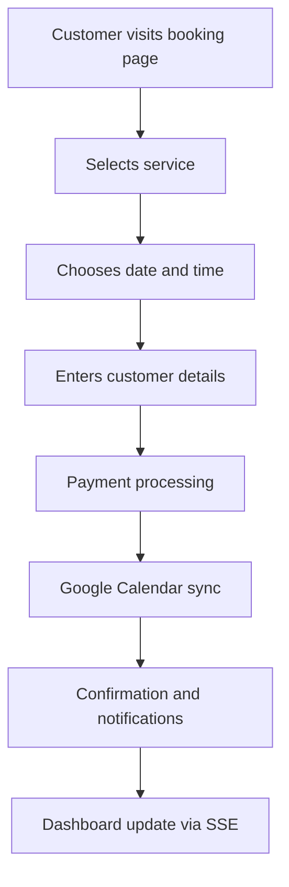

# Technical Architecture Analysis

## Executive Summary

The appointment booking monorepo represents a sophisticated, multi-tenant SaaS platform built with modern cloud-native architecture patterns. This comprehensive analysis examines the technical architecture, system design patterns, component interactions, and deployment strategy across a complex ecosystem of applications, shared packages, and external integrations.

## System Overview

### Architecture Pattern: Multi-Tenant SaaS Monorepo

The system follows a **modular monorepo architecture** using PNPM workspaces and Turbo for efficient builds and dependency management. This approach enables:

- **Code Reusability**: Shared packages across multiple applications
- **Consistent Dependencies**: Centralized dependency management
- **Unified Build Process**: Coordinated deployment pipeline
- **Type Safety**: End-to-end TypeScript coverage

### Technology Stack

- **Frontend Framework**: Next.js 14 with App Router
- **Database**: Cloudflare D1 (SQLite) with Drizzle ORM
- **Authentication**: NextAuth.js v4 with Google OAuth
- **Deployment Platform**: Cloudflare Pages & Workers
- **Payment Processing**: Multi-gateway support (Stripe, PayFast, Yoco, Paystack, Netcash, Payflex)
- **AI Integration**: Google Gemini & OpenAI clients
- **Real-time Updates**: Server-Sent Events (SSE)
- **Monitoring**: Sentry APM with comprehensive alerting

## Core Architecture Components

### 1. Application Layer

#### Booking Application (`apps/booking`)

**Purpose**: Primary customer-facing booking interface

**Key Features**:

- Multi-tenant routing (`[tenant]` dynamic routes)
- Progressive booking flow with React Query state management
- Google Calendar integration with OAuth 2.0
- Real-time availability checking
- Payment processing integration
- AI-powered booking assistant (Nia Agent)

**Architecture Pattern**:

- **Component Structure**: Atomic design with shared UI components
- **State Management**: React Query for server state, useState for local state
- **Routing**: Dynamic tenant routing with catch-all patterns
- **API Integration**: RESTful API calls with error handling

**Critical Files**:

- `components/booking/modern-booking-page.tsx`: Main booking interface
- `app/[tenant]/page.tsx`: Tenant-specific routing
- `lib/ai/agents/NiaAgent.ts`: AI booking assistant
- `app/api/google-calendar/*`: Calendar integration routes

#### Dashboard Application (`apps/dashboard`)

**Purpose**: Administrative interface for salon owners

**Key Features**:

- Real-time booking management
- Revenue tracking and analytics
- Staff schedule management
- System monitoring dashboard
- SSE-based live updates

**Architecture Pattern**:

- **Data Flow**: Server-Sent Events for real-time updates
- **State Management**: Client-side state with periodic refresh
- **Component Design**: Modern dashboard with metric cards and tables

#### Marketing Application (`apps/marketing`)

**Purpose**: Landing pages and marketing campaigns

**Key Features**:

- Tenant-specific branding
- Service showcase
- Customer acquisition funnel
- SEO optimization

### 2. Shared Packages Architecture

#### Database Package (`packages/db`)

**Purpose**: Centralized database schema and operations

**Architecture Pattern**:

- **Schema Design**: Multi-tenant with tenant isolation
- **ORM**: Drizzle ORM with type-safe queries
- **Migration Strategy**: Version-controlled schema evolution
- **Indexing**: Strategic indexes for performance optimization

**Core Schema Entities**:

```typescript
// Multi-tenant core entities
tenants (isolated data per tenant)
users (tenant-scoped user accounts)
appointments (booking records with optimistic locking)
services (salon services with SuperSaaS integration)
employees (staff management with schedules)

// Advanced features
calendarConnections (Google Calendar sync)
analyticsEvents (business intelligence tracking)
aiAgentLogs (AI conversation analytics)
notifications (multi-channel messaging)
products (ecommerce integration)
paymentPlans (deposit and installment management)
```

**Key Architectural Decisions**:

- **Optimistic Locking**: Version field for concurrent booking conflicts
- **Tenant Isolation**: All queries scoped by tenant_id
- **Audit Trail**: Comprehensive logging for business operations
- **SuperSaaS Integration**: External platform synchronization

#### Authentication Package (`packages/auth`)

**Purpose**: Unified authentication and authorization

**Architecture Pattern**:

- **Provider Pattern**: Multiple OAuth providers (Google primary)
- **JWT Strategy**: Stateless session management
- **RBAC System**: Role-based access control with permissions
- **Tenant Association**: Automatic tenant linking during authentication

**Security Features**:

- **OAuth 2.0**: Google Calendar and profile access
- **JWT Tokens**: Secure, stateless authentication
- **Role-Based Permissions**: Granular access control
- **Session Management**: Configurable session strategies

#### AI Package (`packages/ai`)

**Purpose**: AI service integration and management

**Architecture Pattern**:

- **Factory Pattern**: Multiple AI provider support
- **Client Abstraction**: Unified interface for different AI services
- **Provider Strategy**: Google Gemini and OpenAI integration

**Key Components**:

```typescript
class AIClient {
    // Multi-provider support
    googleClient?: GoogleGenerativeAI;
    openAIClient?: OpenAI;
    
    // Unified interface
    async generateText(prompt: string, provider: 'google' | 'openai'): Promise<string>
}
```

#### Payments Package (`packages/payments`)

**Purpose**: Multi-gateway payment processing

**Architecture Pattern**:

- **Gateway Pattern**: Abstract payment processing interface
- **Strategy Pattern**: Dynamic gateway selection based on tenant configuration
- **Multi-Currency**: Support for ZAR (South African Rand) and international currencies

**Supported Gateways**:

- **Stripe**: International credit card processing
- **PayFast**: South African redirect-based payments
- **Yoco**: Local South African card processing
- **Paystack**: African payment solutions
- **Netcash**: South African banking integration
- **Payflex**: Flexible payment plans

**Gateway Selection Logic**:

```typescript
export const getPaymentGateway = (tenant: TenantConfig): PaymentGateway => {
    if (tenant.currency === 'ZAR') {
        return PaymentGateway.PAYFAST; // Prefer local for ZAR
    }
    return PaymentGateway.STRIPE; // Default international
};
```

#### Worker Package (`packages/worker`)

**Purpose**: Cloudflare Worker for serverless API endpoints

**Architecture Pattern**:

- **Serverless Functions**: Stateless API endpoints
- **Event-Driven**: SSE for real-time updates
- **Multi-Tenant API**: Tenant-scoped data access
- **Rate Limiting**: Per-tenant and global rate limits

**API Structure** (from OpenAPI specification):

```
/api/book - Public booking creation
/api/tenant - Tenant information and services
/api/dashboard - Admin dashboard statistics
/api/dashboard/stream - Real-time SSE updates
/api/products - Ecommerce product catalog
/api/ai - AI conversation logging and analytics
/api/health - System health monitoring
```

### 3. Integration Architecture

#### Google Calendar Integration

**Implementation**: OAuth 2.0 flow with token management

**Key Components**:

- `apps/booking/app/api/google-calendar/oauth/route.ts`: OAuth initiation
- `apps/booking/app/api/google-calendar/oauth/callback/route.ts`: Token exchange
- `apps/booking/app/api/google-calendar/status/route.ts`: Connection status
- Database tables: `calendarConnections`, `calendarSyncEvents`

**Architecture Pattern**:

- **OAuth Flow**: Secure token exchange and storage
- **Token Refresh**: Automatic token renewal
- **Sync Management**: Bidirectional calendar synchronization
- **Error Handling**: Graceful degradation on API failures

#### SuperSaaS Integration

**Purpose**: External booking platform synchronization

**Architecture Pattern**:

- **ID Mapping**: Foreign key relationships for cross-platform sync
- **Conflict Resolution**: Optimistic locking for concurrent updates
- **Data Transformation**: Schema mapping between systems
- **Audit Trail**: Change tracking for debugging

### 4. Database Architecture

#### Cloudflare D1 (SQLite) Configuration

**Database Strategy**: Multi-tenant SQLite with strategic indexing

**Configuration** (`drizzle.config.ts`):

```typescript
export default defineConfig({
  dialect: 'sqlite',
  schema: './packages/db/src/schema.ts',
  out: './drizzle',
  driver: 'd1',
  dbCredentials: {
    wranglerConfigPath: 'wrangler.toml',
    dbName: 'appointmentbooking-db',
  },
});
```

**Performance Optimizations**:

- **Strategic Indexing**: Optimized for common query patterns
- **Tenant Isolation**: Efficient multi-tenant data partitioning
- **Query Optimization**: Drizzle ORM query optimization
- **Connection Pooling**: Efficient database connection management

**Key Schema Patterns**:

```sql
-- Optimistic locking for concurrency
CREATE TABLE appointments (
  version INTEGER NOT NULL DEFAULT 1
);

-- Tenant isolation
CREATE INDEX appointments_tenant_idx ON appointments(tenant_id);

-- Performance indexes
CREATE INDEX appointments_scheduled_idx ON appointments(scheduled_time);
CREATE INDEX users_email_idx ON users(email);
```

### 5. Frontend Architecture

#### Component Design System

**Pattern**: Atomic design with shared UI components

**Key Components**:

- **Atomic**: Input fields, buttons, icons (Radix UI primitives)
- **Molecules**: Form groups, card components
- **Organisms**: Booking flow, service cards
- **Templates**: Page layouts, dashboard frameworks

**State Management Strategy**:

```typescript
// Server state with React Query
const { data: services } = useQuery({
  queryKey: ['services', tenantId],
  queryFn: () => fetchServices(tenantId),
});

// Local state for UI interactions
const [selectedService, setSelectedService] = useState<Service | null>(null);
```

#### Real-time Updates Architecture

**Implementation**: Server-Sent Events (SSE) for dashboard updates

**Pattern**:

```typescript
// Client-side SSE connection
const eventSource = new EventSource(`/api/dashboard/stream?tenantId=${tenantId}`);

eventSource.onmessage = (event) => {
  const data = JSON.parse(event.data);
  updateDashboard(data);
};
```

### 6. Deployment Architecture

#### Cloudflare Pages & Workers

**Deployment Strategy**: JAMstack with serverless functions

**Architecture Pattern**:

- **Static Site Generation**: Next.js build artifacts to Cloudflare Pages
- **API Functions**: Cloudflare Workers for dynamic endpoints
- **Database**: Cloudflare D1 for persistent storage
- **CDN**: Global edge caching for optimal performance

**Build Process**:

```bash
# Turbo-powered monorepo build
turbo run build

# Cloudflare deployment
wrangler deploy
```

#### Environment Management

**Configuration**: Environment-specific settings

**Key Configurations**:

- **Development**: Local development with mock services
- **Staging**: Pre-production testing environment
- **Production**: Live environment with monitoring

### 7. Monitoring & Observability

#### Comprehensive Monitoring Stack

**Sentry APM**: Application performance monitoring
**Custom Alerting**: Business and technical metrics
**Health Checks**: System availability monitoring

**Alert Configuration** (`monitoring/alerting-configuration.yaml`):

- **SEV1**: Critical (15-min response)
- **SEV2**: High (1-hour response)
- **SEV3**: Medium (4-hour response)
- **SEV4**: Low (24-hour response)

**Key Metrics**:

- **Technical**: Response times, error rates, uptime
- **Business**: Conversion rates, revenue metrics, customer satisfaction
- **Security**: Authentication failures, suspicious activity

## Data Flow Architecture

### 1. Booking Flow



### 2. Multi-Tenant Data Isolation

```typescript
// Tenant-scoped database queries
const appointments = await db
  .select()
  .from(appointments)
  .where(eq(appointments.tenantId, tenantId));
```

### 3. AI Assistant Integration

```typescript
// AI-powered booking assistance
const response = await niaAgent.handleBookingIntent(
  userId,
  message,
  { tenantId, serviceContext }
);
```

## Security Architecture

### 1. Authentication & Authorization

- **OAuth 2.0**: Secure third-party authentication
- **JWT Tokens**: Stateless session management
- **RBAC**: Role-based permission system
- **Tenant Isolation**: Data-level security

### 2. API Security

- **Rate Limiting**: Per-tenant and global limits
- **Input Validation**: Comprehensive request validation
- **SQL Injection Prevention**: Drizzle ORM parameterized queries
- **CORS Configuration**: Proper cross-origin resource sharing

### 3. Data Protection

- **Encryption**: At-rest and in-transit encryption
- **PII Handling**: Sensitive data protection
- **Audit Logging**: Comprehensive activity tracking
- **Backup Strategy**: Automated data backups

## Performance Architecture

### 1. Frontend Performance

- **Code Splitting**: Automatic route-based splitting
- **Image Optimization**: Next.js automatic image optimization
- **Caching Strategy**: Aggressive caching for static content
- **Bundle Optimization**: Tree shaking and minification

### 2. Backend Performance

- **Database Indexing**: Optimized query performance
- **Connection Pooling**: Efficient database connections
- **Caching Layer**: Application-level caching
- **CDN Integration**: Global edge caching

### 3. Scalability Design

- **Serverless Architecture**: Automatic scaling
- **Database Optimization**: Efficient multi-tenant queries
- **Event-Driven Updates**: SSE for real-time data
- **Microservices Pattern**: Modular service architecture

## Integration Architecture

### 1. Payment Gateway Integration

**Pattern**: Strategy pattern with gateway abstraction

```typescript
interface PaymentRouter {
  processDeposit(bookingId: string, amount: number, currency: string): Promise<PaymentResult>;
  handleWebhook(event: Request): Promise<void>;
}
```

### 2. External API Integration

**Google Calendar**: OAuth-based integration
**SuperSaaS**: ID mapping and sync
**AI Services**: Provider-agnostic interface
**Notification Services**: Multi-channel messaging

### 3. Third-Party Services

- **Analytics**: Business intelligence tracking
- **Monitoring**: Application performance monitoring
- **Communication**: Email and SMS services
- **Storage**: File and image management

## Development Architecture

### 1. Monorepo Structure

```
appointmentbooking-monorepo/
├── apps/                 # Applications
│   ├── booking/         # Customer booking app
│   ├── dashboard/       # Admin dashboard
│   └── marketing/       # Landing pages
├── packages/            # Shared packages
│   ├── auth/           # Authentication
│   ├── db/             # Database schema
│   ├── payments/       # Payment processing
│   ├── ai/             # AI integration
│   └── worker/         # Cloudflare Workers
├── scripts/            # Build and deployment scripts
└── docs/              # Documentation
```

### 2. Build System

**Turbo**: Monorepo build orchestration
**PNPM**: Efficient package management
**TypeScript**: Type safety across all packages
**ESLint/Prettier**: Code quality and formatting

### 3. Development Workflow

- **Git-based Development**: Feature branch workflow
- **Automated Testing**: Unit and integration tests
- **Continuous Integration**: Automated build and deployment
- **Environment Management**: Development, staging, production

## Scalability Considerations

### 1. Horizontal Scaling

- **Serverless Architecture**: Automatic scaling with Cloudflare Workers
- **Database Scaling**: Cloudflare D1 with read replicas
- **CDN Distribution**: Global edge network
- **Microservices**: Modular service architecture

### 2. Data Management

- **Multi-tenant Isolation**: Efficient data partitioning
- **Query Optimization**: Indexed database operations
- **Caching Strategy**: Multi-level caching
- **Data Archiving**: Historical data management

### 3. Performance Optimization

- **Real-time Updates**: Efficient SSE implementation
- **Lazy Loading**: On-demand resource loading
- **Bundle Optimization**: Minimal JavaScript payload
- **Database Optimization**: Query performance tuning

## Conclusion

The appointment booking monorepo demonstrates sophisticated software architecture principles with a focus on scalability, maintainability, and user experience. The multi-tenant SaaS architecture enables efficient resource utilization while providing isolated experiences for each tenant. The comprehensive integration with external services, robust security measures, and modern deployment strategy position this platform for sustainable growth and adaptation to evolving business requirements.

The modular monorepo structure promotes code reusability and maintainability, while the serverless deployment architecture ensures optimal performance and cost efficiency. The comprehensive monitoring and alerting system provides operational visibility and ensures high availability for business-critical operations.
