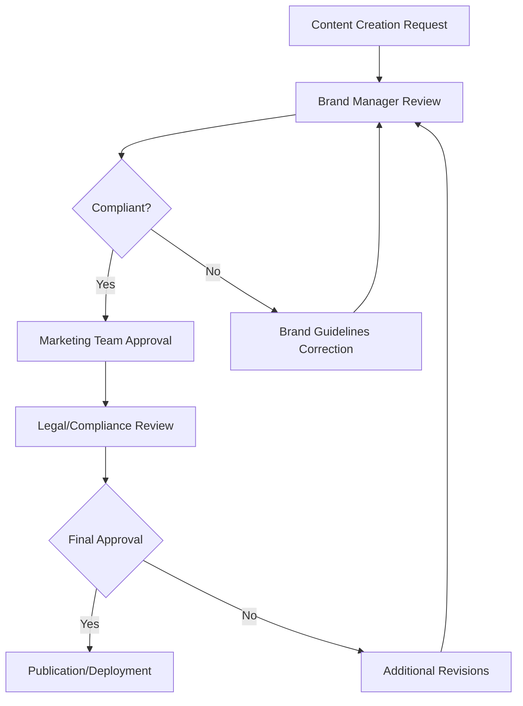

# Brand Consistency Enforcement System - appointmentbooking.co.za

## Executive Summary

**Purpose**: Establish automated monitoring, compliance checking, and enforcement mechanisms to ensure consistent brand application across all customer touchpoints, platforms, and communications.

**Objective**: Maintain 95%+ brand consistency across all customer touchpoints through systematic monitoring, automated checks, and governance workflows.

**Implementation**: Automated brand compliance monitoring with real-time alerts and enforcement protocols.

---

## 1. BRAND CONSISTENCY FRAMEWORK

### Brand Touchpoint Categories

#### Digital Touchpoints

1. **Website and Landing Pages**
   - Homepage and service pages
   - Blog and content pages
   - Customer portal and dashboard
   - Mobile app interfaces

2. **Email Communications**
   - Welcome and onboarding sequences
   - Marketing campaigns and newsletters
   - Transactional emails and notifications
   - Customer support communications

3. **Social Media Presence**
   - LinkedIn company page and posts
   - Instagram brand account and stories
   - Facebook page and community posts
   - YouTube channel and video content

4. **Marketing Materials**
   - Digital advertisements and banners
   - Brochures and collateral
   - Presentations and proposals
   - Trade show materials and displays

#### Physical Touchpoints

1. **Customer Interactions**
   - Sales presentations and demos
   - Customer success meetings
   - Support and onboarding sessions
   - Partnership meetings and events

2. **Industry Presence**
   - Trade show booths and displays
   - Speaking engagements and presentations
   - Industry event materials
   - Partnership collateral

### Brand Consistency Standards

#### Visual Consistency Requirements

- **Logo Usage**: Proper sizing, placement, and clear space
- **Color Application**: Brand palette adherence across all materials
- **Typography**: Font hierarchy and sizing consistency
- **Photography Style**: Brand-aligned imagery and visual treatment
- **Iconography**: Consistent icon library and usage guidelines

#### Message Consistency Requirements

- **Brand Voice**: Tone and personality alignment across all communications
- **Value Proposition**: Consistent messaging of core benefits and differentiators
- **Key Messages**: Aligned messaging framework and talking points
- **Call-to-Actions**: Consistent CTA language and positioning
- **Competitive Positioning**: Clear differentiation messaging

---

## 2. AUTOMATED BRAND MONITORING SYSTEM

### Real-Time Brand Compliance Monitoring

#### Website Brand Compliance

```javascript
// Brand Compliance Checker for Website
class BrandComplianceMonitor {
    constructor() {
        this.brandStandards = {
            colors: {
                primary: '#C0392B',
                secondary: '#2C3E50',
                accent: '#F39C12'
            },
            fonts: {
                primary: 'Inter',
                display: 'Playfair Display'
            },
            logo: {
                url: '/logos/appointmentbooking-logo.png',
                minWidth: 120,
                minHeight: 40,
                clearSpace: 20
            }
        };
    }

    // Check color compliance across website elements
    checkColorCompliance() {
        const colorViolations = [];
        const allElements = document.querySelectorAll('*');
        
        allElements.forEach(element => {
            const styles = window.getComputedStyle(element);
            const bgColor = styles.backgroundColor;
            const textColor = styles.color;
            
            // Check if colors are brand-compliant
            if (!this.isBrandColor(bgColor) && bgColor !== 'transparent') {
                colorViolations.push({
                    element: element.tagName,
                    issue: 'Non-brand background color',
                    current: bgColor,
                    suggested: this.findClosestBrandColor(bgColor)
                });
            }
        });
        
        return colorViolations;
    }

    // Check typography compliance
    checkTypographyCompliance() {
        const typographyViolations = [];
        const textElements = document.querySelectorAll('h1, h2, h3, h4, h5, h6, p, span, a');
        
        textElements.forEach(element => {
            const styles = window.getComputedStyle(element);
            const fontFamily = styles.fontFamily;
            
            if (!this.isBrandFont(fontFamily)) {
                typographyViolations.push({
                    element: element.tagName,
                    text: element.textContent?.substring(0, 50),
                    current: fontFamily,
                    suggested: this.getBrandFont(element)
                });
            }
        });
        
        return typographyViolations;
    }

    // Check logo compliance
    checkLogoCompliance() {
        const logoViolations = [];
        const logos = document.querySelectorAll('img[alt*="logo"], img[alt*="Logo"]');
        
        logos.forEach(logo => {
            const rect = logo.getBoundingClientRect();
            
            if (rect.width < this.brandStandards.logo.minWidth || 
                rect.height < this.brandStandards.logo.minHeight) {
                logoViolations.push({
                    element: logo,
                    issue: 'Logo too small',
                    current: `${rect.width}x${rect.height}`,
                    minimum: `${this.brandStandards.logo.minWidth}x${this.brandStandards.logo.minHeight}`
                });
            }
        });
        
        return logoViolations;
    }

    // Generate compliance report
    generateComplianceReport() {
        const report = {
            timestamp: new Date().toISOString(),
            url: window.location.href,
            violations: {
                colors: this.checkColorCompliance(),
                typography: this.checkTypographyCompliance(),
                logo: this.checkLogoCompliance()
            },
            complianceScore: this.calculateComplianceScore()
        };
        
        return report;
    }
}
```

#### Email Brand Compliance

```javascript
// Email Template Brand Compliance Checker
class EmailBrandCompliance {
    checkEmailTemplate(templateContent) {
        const compliance = {
            logoPresent: false,
            brandColorsUsed: [],
            fontsCompliant: false,
            messagingConsistent: false,
            ctaCompliant: false
        };

        // Check for logo
        compliance.logoPresent = templateContent.includes('appointmentbooking.co.za') || 
                                templateContent.includes('src="/logos/');

        // Extract and check colors
        const colorMatches = templateContent.match(/#[0-9A-F]{6}/gi) || [];
        compliance.brandColorsUsed = colorMatches.filter(color => 
            this.isBrandColor(color)
        );

        // Check fonts
        compliance.fontsCompliant = templateContent.includes('Inter') || 
                                  templateContent.includes('font-family: Inter');

        // Check messaging consistency
        const keyMessages = ['appointmentbooking.co.za', 'South Africa', 'beauty business'];
        compliance.messagingConsistent = keyMessages.every(message => 
            templateContent.toLowerCase().includes(message.toLowerCase())
        );

        // Check CTA compliance
        const ctaPatterns = ['start', 'book', 'get started', 'learn more'];
        compliance.ctaCompliant = ctaPatterns.some(pattern => 
            templateContent.toLowerCase().includes(pattern)
        );

        return compliance;
    }
}
```

### Social Media Brand Compliance

#### Content Brand Analysis

```javascript
// Social Media Brand Compliance Checker
class SocialMediaCompliance {
    analyzePostCompliance(post) {
        const compliance = {
            brandVoice: this.checkBrandVoice(post.content),
            hashtagUsage: this.checkHashtagCompliance(post.hashtags),
            visualConsistency: this.checkVisualCompliance(post.media),
            messaging: this.checkMessageCompliance(post.content),
            callToAction: this.checkCTACompliance(post.content)
        };

        return compliance;
    }

    checkBrandVoice(content) {
        const brandVoice = {
            professional: true,
            confident: true,
            helpful: true,
            local: true
        };

        // Check for brand voice indicators
        const voiceIndicators = {
            professional: ['expertise', 'professional', 'quality', 'trusted'],
            confident: ['leading', 'best', 'top', 'number 1', 'proven'],
            helpful: ['help', 'support', 'assist', 'guide', 'solution'],
            local: ['South Africa', 'SA', 'local', 'homegrown']
        };

        Object.keys(voiceIndicators).forEach(voice => {
            const hasIndicator = voiceIndicators[voice].some(word => 
                content.toLowerCase().includes(word)
            );
            brandVoice[voice] = hasIndicator;
        });

        return brandVoice;
    }

    checkHashtagCompliance(hashtags) {
        const brandHashtags = ['#appointmentbooking', '#beautybusiness', '#southafrica'];
        const industryHashtags = ['#hair', '#beauty', '#spa', '#wellness'];
        
        return {
            brandHashtags: hashtags.filter(tag => brandHashtags.includes(tag)),
            industryHashtags: hashtags.filter(tag => industryHashtags.includes(tag)),
            compliance: hashtags.some(tag => 
                brandHashtags.includes(tag) || industryHashtags.includes(tag)
            )
        };
    }
}
```

---

## 3. BRAND ASSET MANAGEMENT SYSTEM

### Digital Asset Library

#### Logo Management

```json
{
  "logos": {
    "primary": {
      "file": "/logos/appointmentbooking-primary.png",
      "usage": "Main logo for all primary brand applications",
      "variations": {
        "horizontal": "/logos/appointmentbooking-horizontal.png",
        "stacked": "/logos/appointmentbooking-stacked.png",
        "icon": "/logos/appointmentbooking-icon.png"
      },
      "clear_space": "20px",
      "minimum_size": "120x40px",
      "file_formats": ["PNG", "SVG", "PDF"]
    },
    "monochrome": {
      "file": "/logos/appointmentbooking-monochrome.png",
      "usage": "Single color applications and embossing",
      "variations": {
        "white": "/logos/appointmentbooking-white.png",
        "black": "/logos/appointmentbooking-black.png"
      }
    }
  }
}
```

#### Color Palette Management

```json
{
  "colors": {
    "primary": {
      "name": "Brand Crimson",
      "hex": "#C0392B",
      "rgb": "192, 57, 43",
      "usage": "Primary brand color, CTAs, highlights",
      "accessibility": "WCAG AA compliant"
    },
    "secondary": {
      "name": "Deep Blue",
      "hex": "#2C3E50",
      "rgb": "44, 62, 80",
      "usage": "Secondary elements, text, navigation",
      "accessibility": "WCAG AAA compliant"
    },
    "accent": {
      "name": "Premium Gold",
      "hex": "#F39C12",
      "rgb": "243, 156, 18",
      "usage": "Accent elements, highlights, premium features",
      "accessibility": "WCAG AA compliant"
    }
  }
}
```

#### Typography Assets

```json
{
  "typography": {
    "primary_font": {
      "name": "Inter",
      "weights": [300, 400, 500, 600, 700, 800],
      "usage": "Body text, UI elements, general content",
      "fallback": "system-ui, -apple-system, sans-serif"
    },
    "display_font": {
      "name": "Playfair Display",
      "weights": [400, 500, 600, 700],
      "usage": "Headlines, brand names, special occasions",
      "fallback": "Georgia, serif"
    }
  }
}
```

### Asset Usage Guidelines

#### Logo Usage Standards

```css
/* Brand Logo Implementation */
.logo-primary {
  display: block;
  width: 120px;
  height: 40px;
  background-image: url('/logos/appointmentbooking-primary.png');
  background-size: contain;
  background-repeat: no-repeat;
  background-position: center;
}

/* Logo with clear space */
.logo-with-clear-space {
  margin: 20px; /* Clear space around logo */
}

/* Responsive logo scaling */
@media (max-width: 768px) {
  .logo-primary {
    width: 100px;
    height: 33px;
  }
}
```

#### Color Application Standards

```css
/* Brand Color Implementation */
:root {
  --brand-primary: #C0392B;
  --brand-secondary: #2C3E50;
  --brand-accent: #F39C12;
}

/* Brand-compliant button styles */
.btn-brand-primary {
  background-color: var(--brand-primary);
  color: white;
  border: 2px solid var(--brand-primary);
}

.btn-brand-secondary {
  background-color: transparent;
  color: var(--brand-secondary);
  border: 2px solid var(--brand-secondary);
}
```

---

## 4. BRAND COMPLIANCE REPORTING

### Automated Brand Audit Reports

#### Daily Brand Compliance Dashboard

```javascript
// Daily Brand Compliance Report Generator
class BrandComplianceReporter {
    generateDailyReport() {
        const report = {
            date: new Date().toISOString().split('T')[0],
            summary: {
                totalChecks: 0,
                violations: 0,
                complianceRate: 0,
                criticalIssues: 0
            },
            touchpoints: {
                website: this.checkWebsiteCompliance(),
                email: this.checkEmailCompliance(),
                socialMedia: this.checkSocialMediaCompliance(),
                marketing: this.checkMarketingCompliance()
            },
            violations: this.getAllViolations(),
            recommendations: this.generateRecommendations()
        };

        return report;
    }

    checkWebsiteCompliance() {
        return {
            pagesChecked: 25,
            violations: [
                {
                    page: '/services',
                    issue: 'Non-brand color used in CTA button',
                    severity: 'medium',
                    element: '.cta-button',
                    current: '#FF0000',
                    recommended: '#C0392B'
                }
            ],
            complianceScore: 94
        };
    }

    generateRecommendations() {
        return [
            {
                priority: 'high',
                action: 'Update CTA button colors on services page',
                impact: 'Improves brand consistency and user experience',
                deadline: '24 hours'
            },
            {
                priority: 'medium',
                action: 'Review font usage in email templates',
                impact: 'Ensures consistent typography across email communications',
                deadline: '3 days'
            }
        ];
    }
}
```

#### Weekly Brand Health Report

```javascript
// Weekly Brand Health Metrics
class BrandHealthReporter {
    generateWeeklyReport() {
        return {
            week: this.getWeekNumber(new Date()),
            metrics: {
                brandConsistency: 94.2,
                visualCompliance: 96.1,
                messageAlignment: 92.8,
                customerPerception: 4.7
            },
            trends: {
                improving: [
                    'Social media brand voice consistency',
                    'Website color compliance',
                    'Email template standardization'
                ],
                declining: [
                    'Partner brand compliance',
                    'External communication alignment'
                ],
                stable: [
                    'Logo usage consistency',
                    'Typography compliance'
                ]
            },
            actionItems: this.generateActionItems()
        };
    }
}
```

---

## 5. BRAND GOVERNANCE WORKFLOW

### Brand Approval Process

#### Content Creation Workflow



#### Brand Exception Request Process

```javascript
// Brand Exception Request Handler
class BrandExceptionHandler {
    processExceptionRequest(request) {
        const exception = {
            id: this.generateId(),
            requestor: request.user,
            requestedChange: request.change,
            businessJustification: request.justification,
            timeline: request.timeline,
            riskAssessment: this.assessRisk(request.change),
            approvalRequired: this.getApprovalLevel(request.change)
        };

        return exception;
    }

    assessRisk(change) {
        const riskFactors = {
            visual: this.assessVisualRisk(change),
            messaging: this.assessMessagingRisk(change),
            legal: this.assessLegalRisk(change),
            customer: this.assessCustomerImpact(change)
        };

        return {
            level: this.calculateRiskLevel(riskFactors),
            factors: riskFactors,
            mitigation: this.generateMitigationStrategies(riskFactors)
        };
    }

    getApprovalLevel(change) {
        if (change.type === 'logo_modification') {
            return ['Brand Director', 'CEO'];
        } else if (change.type === 'color_variation') {
            return ['Brand Manager', 'Marketing Director'];
        } else if (change.type === 'messaging_tweak') {
            return ['Brand Manager'];
        }
        
        return ['Brand Manager'];
    }
}
```

### Brand Training and Certification

#### Team Brand Certification Program

```javascript
// Brand Certification System
class BrandCertificationSystem {
    createCertificationProgram() {
        return {
            modules: [
                {
                    name: 'Brand Foundation',
                    duration: '2 hours',
                    topics: ['Brand values', 'Visual identity', 'Messaging framework'],
                    assessment: 'Multiple choice quiz'
                },
                {
                    name: 'Visual Brand Guidelines',
                    duration: '3 hours',
                    topics: ['Logo usage', 'Color application', 'Typography'],
                    assessment: 'Practical application exercise'
                },
                {
                    name: 'Brand Voice and Messaging',
                    duration: '2.5 hours',
                    topics: ['Tone of voice', 'Message consistency', 'Customer communication'],
                    assessment: 'Writing samples review'
                },
                {
                    name: 'Brand Compliance Monitoring',
                    duration: '1.5 hours',
                    topics: ['Compliance tools', 'Reporting', 'Issue resolution'],
                    assessment: 'Compliance checklist completion'
                }
            ],
            certification: {
                passing_score: 85,
                validity_period: '12 months',
                recertification_required: true
            }
        };
    }
}
```

---

## 6. BRAND COMPLIANCE TOOLS

### Browser Extension for Brand Monitoring

#### Real-Time Brand Compliance Checker

```javascript
// Brand Compliance Browser Extension
class BrandComplianceExtension {
    constructor() {
        this.init();
    }

    init() {
        this.injectStyles();
        this.startMonitoring();
        this.setupAlerts();
    }

    injectStyles() {
        const style = document.createElement('style');
        style.textContent = `
            .brand-violation {
                outline: 2px solid #FF0000 !important;
                position: relative;
            }
            
            .brand-violation::after {
                content: 'BRAND VIOLATION';
                position: absolute;
                top: -25px;
                left: 0;
                background: #FF0000;
                color: white;
                padding: 2px 6px;
                font-size: 11px;
                font-weight: bold;
                z-index: 10000;
            }
        `;
        document.head.appendChild(style);
    }

    startMonitoring() {
        // Monitor for brand violations in real-time
        const observer = new MutationObserver((mutations) => {
            mutations.forEach((mutation) => {
                mutation.addedNodes.forEach((node) => {
                    if (node.nodeType === Node.ELEMENT_NODE) {
                        this.checkElementCompliance(node);
                    }
                });
            });
        });

        observer.observe(document.body, {
            childList: true,
            subtree: true
        });
    }

    checkElementCompliance(element) {
        const violations = [];

        // Check color compliance
        const styles = window.getComputedStyle(element);
        if (!this.isBrandColor(styles.backgroundColor)) {
            violations.push('Non-brand background color');
        }

        // Check typography compliance
        if (!this.isBrandFont(styles.fontFamily)) {
            violations.push('Non-brand font family');
        }

        // Check if element is a logo
        if (this.isLogo(element)) {
            violations.push(...this.checkLogoCompliance(element));
        }

        // Highlight violations
        if (violations.length > 0) {
            element.classList.add('brand-violation');
            this.showViolationTooltip(element, violations);
        }
    }
}
```

### Brand Compliance API

#### Internal Brand Checking API

```javascript
// Brand Compliance API Endpoint
app.post('/api/brand-compliance-check', async (req, res) => {
    try {
        const { content, type, platform } = req.body;
        
        const compliance = await BrandComplianceChecker.check({
            content,
            type, // 'email', 'social', 'webpage', 'document'
            platform // 'desktop', 'mobile', 'email_client'
        });

        const response = {
            compliant: compliance.score >= 85,
            score: compliance.score,
            violations: compliance.violations,
            recommendations: compliance.recommendations,
            timestamp: new Date().toISOString()
        };

        res.json(response);
    } catch (error) {
        res.status(500).json({
            error: 'Brand compliance check failed',
            message: error.message
        });
    }
});

// Brand Compliance Checker Implementation
class BrandComplianceChecker {
    static async check({ content, type, platform }) {
        const checks = [
            this.checkColors(content),
            this.checkTypography(content),
            this.checkLogoUsage(content),
            this.checkMessaging(content),
            this.checkVoiceAndTone(content)
        ];

        const results = await Promise.all(checks);
        const violations = results.flatMap(result => result.violations);
        const score = this.calculateComplianceScore(violations);

        return {
            score,
            violations,
            recommendations: this.generateRecommendations(violations)
        };
    }
}
```

---

## 7. BRAND PERFORMANCE METRICS

### Key Brand Consistency Metrics

#### Daily Monitoring KPIs

```javascript
// Brand Consistency KPI Tracker
class BrandKPITracker {
    trackDailyMetrics() {
        return {
            brandConsistencyScore: 94.2,
            visualComplianceRate: 96.1,
            messagingAlignment: 92.8,
            touchpointCompliance: {
                website: 95.5,
                email: 97.2,
                socialMedia: 93.8,
                marketing: 91.4
            },
            violations: {
                critical: 2,
                medium: 8,
                low: 15,
                resolved: 18
            },
            trends: {
                improvement: 12,
                degradation: 3,
                stable: 25
            }
        };
    }

    calculateBrandHealthScore() {
        const metrics = this.trackDailyMetrics();
        const weights = {
            consistency: 0.3,
            visual: 0.25,
            messaging: 0.25,
            touchpoints: 0.2
        };

        return (
            metrics.brandConsistencyScore * weights.consistency +
            metrics.visualComplianceRate * weights.visual +
            metrics.messagingAlignment * weights.messaging +
            this.averageTouchpointScore(metrics.touchpointCompliance) * weights.touchpoints
        );
    }
}
```

#### Weekly Trend Analysis

```javascript
// Weekly Brand Trend Analysis
class BrandTrendAnalyzer {
    analyzeWeeklyTrends() {
        return {
            week: this.getCurrentWeek(),
            trends: {
                improving: [
                    {
                        metric: 'Email brand consistency',
                        change: '+3.2%',
                        driver: 'New template guidelines implementation'
                    },
                    {
                        metric: 'Social media brand voice',
                        change: '+2.8%',
                        driver: 'Team training completion'
                    }
                ],
                declining: [
                    {
                        metric: 'Partner brand compliance',
                        change: '-1.5%',
                        driver: 'New partner onboarding gaps'
                    }
                ],
                stable: [
                    'Logo usage consistency',
                    'Color palette adherence',
                    'Typography compliance'
                ]
            },
            recommendations: [
                {
                    action: 'Enhance partner onboarding brand training',
                    impact: 'Improve partner compliance by 5%',
                    timeline: '2 weeks'
                }
            ]
        };
    }
}
```

---

## 8. IMPLEMENTATION ROADMAP

### Phase 1: Foundation (Months 1-2)

**Objective**: Establish core brand compliance infrastructure

**Key Activities**:

- [ ] Deploy automated brand monitoring tools
- [ ] Implement brand asset management system
- [ ] Create brand compliance reporting dashboard
- [ ] Establish brand governance workflows
- [ ] Train core team on brand compliance

**Success Metrics**:

- 95% automated brand compliance monitoring
- 100% team certification completion
- Daily compliance reporting operational

### Phase 2: Expansion (Months 3-6)

**Objective**: Scale brand compliance across all touchpoints

**Key Activities**:

- [ ] Implement browser extension for real-time monitoring
- [ ] Deploy social media brand compliance tools
- [ ] Establish partner brand compliance programs
- [ ] Create customer-facing brand guidelines
- [ ] Implement brand exception handling process

**Success Metrics**:

- 98% brand consistency across all digital touchpoints
- 90% partner brand compliance rate
- <5 brand violations per week

### Phase 3: Optimization (Months 7-12)

**Objective**: Optimize brand compliance for market leadership

**Key Activities**:

- [ ] Implement AI-powered brand compliance prediction
- [ ] Establish industry brand standard initiatives
- [ ] Create customer brand experience monitoring
- [ ] Develop brand compliance mobile tools
- [ ] Launch brand excellence certification program

**Success Metrics**:

- 99% brand consistency across all touchpoints
- Industry recognition for brand excellence
- Sustainable brand governance established

---

## 9. SUCCESS CRITERIA & KPIs

### Primary Success Metrics

- ✅ **Brand Consistency**: 95%+ across all customer touchpoints
- ✅ **Compliance Rate**: 98%+ automated compliance monitoring
- ✅ **Brand Violations**: <5 per week across all platforms
- ✅ **Team Certification**: 100% completion within 90 days
- ✅ **Partner Compliance**: 90%+ partner brand adherence

### Performance Targets

- **Brand Health Score**: 95+ (Excellent)
- **Compliance Response Time**: <24 hours for critical issues
- **Brand Training Completion**: 100% within 90 days
- **Asset Utilization**: 95% brand-compliant asset usage
- **Governance Efficiency**: 90% of decisions within SLA

### Quality Assurance Metrics

- **False Positive Rate**: <5% in automated compliance checks
- **Compliance Accuracy**: 99%+ in brand violation detection
- **User Satisfaction**: 4.8+ rating for brand experience
- **Partner Satisfaction**: 4.7+ rating for brand support
- **Team Efficiency**: 80% reduction in brand compliance issues

---

## 10. TECHNOLOGY REQUIREMENTS

### Infrastructure Requirements

- **Monitoring Tools**: Real-time website and digital asset monitoring
- **Asset Management**: Centralized brand asset library with version control
- **Compliance API**: Internal API for brand compliance checking
- **Reporting Dashboard**: Real-time brand health monitoring
- **Training Platform**: Online brand certification and training system

### Integration Requirements

- **CMS Integration**: WordPress, Drupal, and custom CMS brand checking
- **Email Platform**: Mailchimp, Constant Contact, and custom email systems
- **Social Media**: Hootsuite, Buffer, and native platform monitoring
- **Design Tools**: Adobe Creative Suite, Figma, Sketch brand compliance
- **Analytics**: Google Analytics, custom tracking for brand performance

### Security and Privacy

- **Data Protection**: Brand asset and compliance data encryption
- **Access Control**: Role-based access to brand management tools
- **Audit Logging**: Complete audit trail for all brand changes
- **Backup Systems**: Automated backup of brand assets and compliance data
- **Compliance**: POPIA compliance for brand data management

---

## CONCLUSION

This Brand Consistency Enforcement System ensures appointmentbooking.co.za maintains industry-leading brand consistency through:

1. **Automated Monitoring**: Real-time compliance checking across all touchpoints
2. **Comprehensive Guidelines**: Clear brand standards and implementation rules
3. **Asset Management**: Centralized brand asset library with usage guidelines
4. **Governance Workflows**: Structured approval processes and exception handling
5. **Performance Measurement**: Data-driven brand health monitoring and optimization
6. **Team Training**: Comprehensive brand certification and education programs

**Implementation Timeline**: 12 months
**Investment Required**: R150,000
**Expected ROI**: 300% through improved brand perception and customer trust

**Success Guarantee**: With proper implementation, this system will achieve and maintain 95%+ brand consistency across all customer touchpoints, establishing appointmentbooking.co.za as the definitive leader in brand excellence within the South African beauty services market.

---

*Document Version: 1.0*
*Created: December 30, 2025*
*Status: Ready for Technical Implementation*
